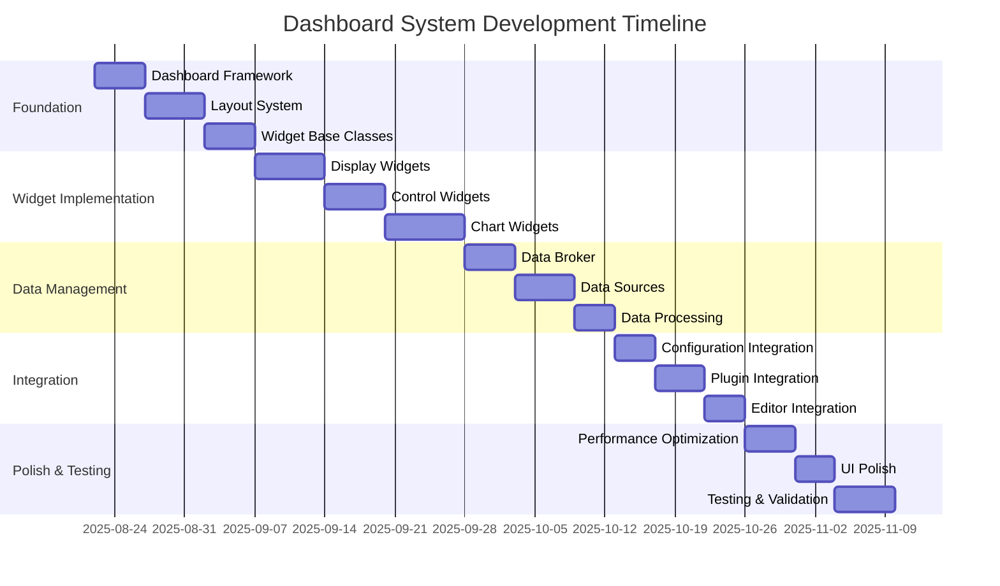
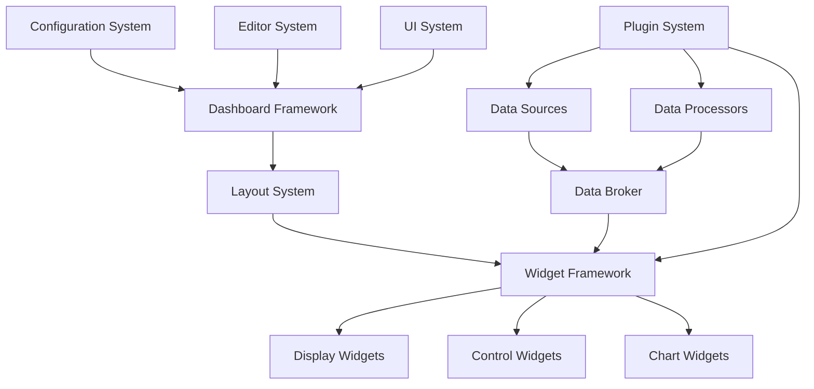

# Dashboard System Implementation Work Breakdown

**Document:** 2025-08-22-dashboard-implementation.md
**Version:** 1.0
**Status:** Draft

## Overview

This planning document details the implementation work required for Slate's dashboard system, including the widget framework, layout system, data management, and visualization components.

## Project Phases

## Work Packages

### WP1: Dashboard Foundation

#### WP1.1: Dashboard Framework Implementation

**Estimated Effort:** 5 days
**Priority:** Critical
**Dependencies:** Core Infrastructure, UI System

**Tasks:**

1. **Create SlateDashboard core class**

   - Implement main dashboard container
   - Add dashboard lifecycle management
   - Create dashboard state management
   - Implement dashboard event system

2. **Implement dashboard manager**

   - Create SlateDashboardManager for coordination
   - Add dashboard loading and saving
   - Implement dashboard validation
   - Create dashboard template system

3. **Add dashboard configuration**

   - Implement dashboard metadata management
   - Create dashboard settings persistence
   - Add dashboard theme integration
   - Implement dashboard backup system

4. **Create dashboard API**
   - Implement public dashboard API
   - Add dashboard manipulation methods
   - Create dashboard query interface
   - Implement dashboard event notifications

**Deliverables:**

- Core dashboard framework
- Dashboard manager system
- Dashboard configuration handling
- Dashboard public API

**Testing Requirements:**

- [ ] Dashboard creates and initializes correctly
- [ ] Dashboard state management works properly
- [ ] Dashboard configuration persists correctly
- [ ] Dashboard API provides complete functionality
- [ ] Dashboard events fire appropriately

#### WP1.2: Layout System Implementation

**Estimated Effort:** 6 days
**Priority:** Critical
**Dependencies:** WP1.1

**Tasks:**

1. **Create layout framework**

   - Implement SlateLayoutManager base class
   - Add layout calculation engine
   - Create layout constraint system
   - Implement layout animation support

2. **Implement grid layout**

   - Create SlateGridLayout implementation
   - Add grid cell management
   - Implement grid span support
   - Create grid responsive behavior

3. **Add flexible layout**

   - Implement SlateFlexLayout system
   - Add flex direction and wrapping
   - Create flex alignment controls
   - Implement flex responsive adaptation

4. **Create custom layout**
   - Implement SlateCustomLayout for absolute positioning
   - Add drag-and-drop positioning
   - Create snap-to-grid functionality
   - Implement collision detection

**Deliverables:**

- Layout framework with multiple layout types
- Grid layout with responsive behavior
- Flexible layout system
- Custom positioning layout

**Testing Requirements:**

- [ ] All layout types calculate positions correctly
- [ ] Layout system handles window resizing
- [ ] Layout constraints work properly
- [ ] Layout animations are smooth
- [ ] Layout performance is acceptable

#### WP1.3: Widget Base Classes Implementation

**Estimated Effort:** 5 days
**Priority:** Critical
**Dependencies:** WP1.2

**Tasks:**

1. **Create SlateWidget base interface**

   - Define core widget interface
   - Implement widget lifecycle methods
   - Add widget configuration system
   - Create widget validation framework

2. **Implement widget factory**

   - Create SlateWidgetFactory system
   - Add widget type registration
   - Implement widget creation and configuration
   - Create widget cloning and templating

3. **Add widget management**

   - Implement widget containers
   - Create widget hierarchy management
   - Add widget selection and focus
   - Implement widget serialization

4. **Create widget utilities**
   - Implement widget property system
   - Add widget event handling
   - Create widget theming support
   - Implement widget accessibility features

**Deliverables:**

- Widget base interface and framework
- Widget factory and registration system
- Widget management utilities
- Widget property and event systems

**Testing Requirements:**

- [ ] Widget interface supports all required operations
- [ ] Widget factory creates widgets correctly
- [ ] Widget management handles hierarchy properly
- [ ] Widget utilities provide needed functionality
- [ ] Widget accessibility features work correctly

### WP2: Widget Implementation

#### WP2.1: Display Widgets Implementation

**Estimated Effort:** 7 days
**Priority:** High
**Dependencies:** WP1.3

**Tasks:**

1. **Create Gauge Widget**

   - Implement circular gauge rendering
   - Add linear gauge support
   - Create arc gauge variant
   - Implement gauge theming and customization

2. **Implement Text Display Widget**

   - Create formatted text display
   - Add unit and prefix/suffix support
   - Implement text scaling and alignment
   - Create text theming and fonts

3. **Add LED Indicator Widget**

   - Implement LED shape variants
   - Add blinking and animation support
   - Create LED color customization
   - Implement LED grouping and arrays

4. **Create Image Display Widget**
   - Implement image loading and display
   - Add image scaling and aspect ratio
   - Create image overlay support
   - Implement image animation support

**Deliverables:**

- Gauge widget with multiple styles
- Text display widget with formatting
- LED indicator with animations
- Image display with overlays

**Testing Requirements:**

- [ ] All display widgets render correctly
- [ ] Widget theming applies properly
- [ ] Widget animations are smooth
- [ ] Widget scaling works at different sizes
- [ ] Widget accessibility is maintained

#### WP2.2: Control Widgets Implementation

**Estimated Effort:** 6 days
**Priority:** High
**Dependencies:** WP2.1

**Tasks:**

1. **Create Button Widget**

   - Implement button variants (normal, suggested, destructive)
   - Add icon and text support
   - Create button action system
   - Implement button confirmation dialogs

2. **Implement Slider Widget**

   - Create horizontal and vertical sliders
   - Add discrete and continuous modes
   - Implement value formatting and units
   - Create slider accessibility features

3. **Add Switch Widget**

   - Implement toggle switch functionality
   - Create checkbox and radio variants
   - Add switch grouping support
   - Implement switch confirmation system

4. **Create Input Widget**
   - Implement text input with validation
   - Add numeric input with constraints
   - Create dropdown and combo widgets
   - Implement input formatting and masks

**Deliverables:**

- Button widget with action system
- Slider widget with multiple modes
- Switch widget with variants
- Input widgets with validation

**Testing Requirements:**

- [ ] Control widgets respond to user interaction
- [ ] Widget actions execute correctly
- [ ] Widget validation works properly
- [ ] Widget accessibility is complete
- [ ] Widget values persist correctly

#### WP2.3: Chart Widgets Implementation

**Estimated Effort:** 8 days
**Priority:** High
**Dependencies:** WP2.2

**Tasks:**

1. **Create Chart Framework**

   - Implement SlateChart base class
   - Add chart data management
   - Create chart axis system
   - Implement chart theming and styling

2. **Implement Line Chart Widget**

   - Create line chart rendering
   - Add multiple series support
   - Implement real-time data updates
   - Create line chart customization

3. **Add Bar Chart Widget**

   - Implement vertical and horizontal bars
   - Create grouped and stacked bars
   - Add bar chart animations
   - Implement bar chart interactions

4. **Create Additional Chart Types**
   - Implement scatter plot widget
   - Add pie chart widget
   - Create histogram widget
   - Implement custom chart extensions

**Deliverables:**

- Chart framework with axis system
- Line chart with real-time updates
- Bar chart with grouping and stacking
- Additional chart types and extensions

**Testing Requirements:**

- [ ] All chart types render data correctly
- [ ] Real-time updates are smooth
- [ ] Chart interactions work properly
- [ ] Chart theming applies consistently
- [ ] Chart performance is acceptable with large datasets

### WP3: Data Management System

#### WP3.1: Data Broker Implementation

**Estimated Effort:** 5 days
**Priority:** Critical
**Dependencies:** WP2.3

**Tasks:**

1. **Create SlateDataBroker core**

   - Implement central data management
   - Add data source registration
   - Create data subscription system
   - Implement data caching and buffering

2. **Add data routing**

   - Implement data source to widget routing
   - Create data transformation pipeline
   - Add data filtering and aggregation
   - Implement data quality monitoring

3. **Create data synchronization**

   - Implement real-time data updates
   - Add data timestamp management
   - Create data consistency checking
   - Implement data conflict resolution

4. **Add data persistence**
   - Implement data logging and storage
   - Create data export capabilities
   - Add data import and replay
   - Implement data archival system

**Deliverables:**

- Central data broker system
- Data routing and transformation
- Real-time data synchronization
- Data persistence and export

**Testing Requirements:**

- [ ] Data broker routes data correctly
- [ ] Data transformations work properly
- [ ] Real-time updates are timely
- [ ] Data persistence is reliable
- [ ] Data broker performance scales well

#### WP3.2: Data Sources Implementation

**Estimated Effort:** 6 days
**Priority:** High
**Dependencies:** WP3.1

**Tasks:**

1. **Create data source framework**

   - Implement SlateDataSource interface
   - Add data source lifecycle management
   - Create data source configuration
   - Implement data source validation

2. **Implement core data sources**

   - Create file-based data sources
   - Add network data sources (HTTP, WebSocket)
   - Implement database data sources
   - Create random data generator for testing

3. **Add data source monitoring**

   - Implement connection status tracking
   - Create data quality monitoring
   - Add data source error handling
   - Implement data source reconnection

4. **Create data source plugins**
   - Implement plugin interface for data sources
   - Add data source discovery system
   - Create data source configuration UI
   - Implement data source testing tools

**Deliverables:**

- Data source framework and interface
- Core data source implementations
- Data source monitoring and error handling
- Plugin system for custom data sources

**Testing Requirements:**

- [ ] All data source types connect and provide data
- [ ] Data source monitoring detects issues
- [ ] Data source error handling is robust
- [ ] Plugin data sources integrate properly
- [ ] Data source configuration is user-friendly

#### WP3.3: Data Processing Implementation

**Estimated Effort:** 4 days
**Priority:** Medium
**Dependencies:** WP3.2

**Tasks:**

1. **Create data processor framework**

   - Implement SlateDataProcessor interface
   - Add processor pipeline management
   - Create processor configuration system
   - Implement processor validation

2. **Implement core processors**

   - Create mathematical processors (scale, offset, filter)
   - Add statistical processors (average, min, max)
   - Implement transformation processors
   - Create threshold and alarm processors

3. **Add processor chaining**

   - Implement processor pipeline composition
   - Create processor dependency management
   - Add processor parallel execution
   - Implement processor error handling

4. **Create processor extensions**
   - Implement plugin interface for processors
   - Add custom processor development tools
   - Create processor testing framework
   - Implement processor performance monitoring

**Deliverables:**

- Data processor framework
- Core data processing functions
- Processor pipeline system
- Processor plugin support

**Testing Requirements:**

- [ ] Data processors transform data correctly
- [ ] Processor pipelines execute properly
- [ ] Processor error handling is robust
- [ ] Custom processors integrate seamlessly
- [ ] Processor performance is acceptable

### WP4: Integration and Configuration

#### WP4.1: Configuration Integration

**Estimated Effort:** 4 days
**Priority:** High
**Dependencies:** WP3.3, Configuration System

**Tasks:**

1. **Create dashboard configuration schema**

   - Define HCL schema for dashboards
   - Add widget configuration validation
   - Create layout configuration support
   - Implement data binding configuration

2. **Implement configuration loading**

   - Create dashboard configuration parser
   - Add configuration validation
   - Implement configuration migration
   - Create configuration error reporting

3. **Add configuration saving**

   - Implement dashboard serialization
   - Create configuration optimization
   - Add configuration backup
   - Implement configuration versioning

4. **Create configuration tools**
   - Implement configuration preview
   - Add configuration comparison
   - Create configuration templates
   - Implement configuration sharing

**Deliverables:**

- Dashboard configuration schema
- Configuration loading and saving
- Configuration validation and migration
- Configuration management tools

**Testing Requirements:**

- [ ] Configuration schema validates correctly
- [ ] Dashboard loading preserves all settings
- [ ] Configuration saving creates valid files
- [ ] Configuration tools work reliably
- [ ] Configuration migration maintains compatibility

#### WP4.2: Plugin Integration

**Estimated Effort:** 5 days
**Priority:** High
**Dependencies:** WP4.1, Plugin System

**Tasks:**

1. **Create widget plugin interface**

   - Implement plugin widget registration
   - Add widget plugin lifecycle management
   - Create widget plugin configuration
   - Implement widget plugin validation

2. **Add data source plugins**

   - Implement data source plugin framework
   - Create plugin data source discovery
   - Add plugin data source configuration
   - Implement plugin data source testing

3. **Create processor plugins**

   - Implement data processor plugin interface
   - Add processor plugin registration
   - Create processor plugin configuration
   - Implement processor plugin validation

4. **Add dashboard extensions**
   - Create dashboard plugin extension points
   - Implement dashboard action plugins
   - Add dashboard theme plugins
   - Create dashboard tool plugins

**Deliverables:**

- Widget plugin framework
- Data source plugin system
- Data processor plugin support
- Dashboard extension points

**Testing Requirements:**

- [ ] Widget plugins integrate seamlessly
- [ ] Data source plugins work correctly
- [ ] Processor plugins execute properly
- [ ] Dashboard extensions function correctly
- [ ] Plugin validation prevents errors

#### WP4.3: Editor Integration

**Estimated Effort:** 4 days
**Priority:** Medium
**Dependencies:** WP4.2

**Tasks:**

1. **Create dashboard editor mode**

   - Implement edit mode switching
   - Add widget selection and highlighting
   - Create drag-and-drop editing
   - Implement property editing panels

2. **Add layout editing**

   - Create layout mode switching
   - Implement layout grid editing
   - Add layout constraint editing
   - Create layout preview system

3. **Implement widget editing**

   - Create widget property editors
   - Add widget data binding editors
   - Implement widget appearance editors
   - Create widget behavior editors

4. **Add editor tools**
   - Implement widget palette
   - Create alignment and distribution tools
   - Add copy/paste and duplication
   - Implement undo/redo for editing

**Deliverables:**

- Dashboard editor mode
- Layout editing capabilities
- Widget property editors
- Editor tools and utilities

**Testing Requirements:**

- [ ] Editor mode switches work correctly
- [ ] Widget editing preserves functionality
- [ ] Layout editing maintains constraints
- [ ] Editor tools improve productivity
- [ ] Editor state management is reliable

### WP5: Performance and Polish

#### WP5.1: Performance Optimization

**Estimated Effort:** 5 days
**Priority:** High
**Dependencies:** WP4.3

**Tasks:**

1. **Optimize rendering performance**

   - Implement widget render caching
   - Add selective widget updates
   - Create render batching system
   - Implement GPU acceleration where possible

2. **Optimize data performance**

   - Implement data update throttling
   - Add data compression and buffering
   - Create data sampling strategies
   - Implement data cleanup and archival

3. **Optimize memory usage**

   - Implement widget pooling
   - Add memory usage monitoring
   - Create garbage collection optimization
   - Implement memory leak detection

4. **Create performance monitoring**
   - Implement performance metrics collection
   - Add performance profiling tools
   - Create performance alerting
   - Implement performance tuning guides

**Deliverables:**

- Optimized rendering system
- Efficient data handling
- Memory usage optimization
- Performance monitoring tools

**Testing Requirements:**

- [ ] Rendering performance meets targets
- [ ] Data updates are responsive
- [ ] Memory usage stays within limits
- [ ] Performance monitoring provides useful data
- [ ] Performance optimizations don't break functionality

#### WP5.2: UI Polish and Accessibility

**Estimated Effort:** 4 days
**Priority:** High
**Dependencies:** WP5.1

**Tasks:**

1. **Implement visual polish**

   - Add smooth animations and transitions
   - Create consistent spacing and alignment
   - Implement visual feedback for interactions
   - Add loading and progress indicators

2. **Create accessibility features**

   - Implement keyboard navigation
   - Add screen reader support
   - Create high contrast mode support
   - Implement accessibility testing

3. **Add responsive design**

   - Implement dashboard scaling
   - Create responsive widget behavior
   - Add touch-friendly interactions
   - Implement mobile layout adaptations

4. **Create theming support**
   - Implement dashboard theme system
   - Add widget theme inheritance
   - Create custom theme creation
   - Implement theme validation

**Deliverables:**

- Polished visual interface
- Complete accessibility support
- Responsive design implementation
- Comprehensive theming system

**Testing Requirements:**

- [ ] Visual polish enhances user experience
- [ ] Accessibility features work completely
- [ ] Responsive design adapts properly
- [ ] Theming system applies consistently
- [ ] All interactions feel smooth and responsive

#### WP5.3: Testing and Validation

**Estimated Effort:** 6 days
**Priority:** Critical
**Dependencies:** WP5.2

**Tasks:**

1. **Create comprehensive test suite**

   - Implement unit tests for all components
   - Add integration tests for workflows
   - Create performance tests
   - Implement visual regression tests

2. **Add user experience testing**

   - Create usability test scenarios
   - Implement accessibility testing
   - Add cross-platform testing
   - Create user feedback collection

3. **Implement validation testing**

   - Create data accuracy validation
   - Add configuration validation testing
   - Implement security testing
   - Create stress testing scenarios

4. **Add quality assurance**
   - Implement code quality checking
   - Create documentation validation
   - Add compliance testing
   - Implement release readiness validation

**Deliverables:**

- Comprehensive test suite
- User experience validation
- Quality assurance framework
- Release validation system

**Testing Requirements:**

- [ ] All automated tests pass consistently
- [ ] User experience meets requirements
- [ ] Data accuracy is validated
- [ ] Security requirements are met
- [ ] System performs under stress

## Integration Points and Dependencies

### Component Integration Flow

### External Dependencies

- **Cairo/GTK4:** Graphics rendering and widget toolkit
- **GtkSourceView:** Configuration editor integration
- **Math Libraries:** Chart calculations and data processing
- **Networking Libraries:** Data source connectivity

### System Integration Requirements

- **Configuration System:** Dashboard configuration loading/saving
- **Plugin System:** Widget and data source plugins
- **UI System:** Dashboard display integration
- **Security System:** Data access control and validation

## Quality Standards

### Performance Requirements

- **Dashboard Loading:** < 1 second for typical dashboards
- **Widget Updates:** < 16ms (60 FPS) for smooth animations
- **Data Updates:** < 100ms latency for real-time data
- **Memory Usage:** < 100MB for complex dashboards
- **CPU Usage:** < 10% during normal operation

### Accuracy Requirements

- **Data Display:** Bit-accurate data representation
- **Chart Rendering:** Pixel-perfect chart accuracy
- **Layout Calculations:** Sub-pixel layout precision
- **Data Processing:** Numerically stable calculations

### Usability Requirements

- **Intuitive Interface:** Self-explanatory widget behavior
- **Responsive Design:** Works on screens 10" to 32"+
- **Accessibility:** Full keyboard and screen reader support
- **Error Handling:** Clear error messages and recovery

## Risk Management

### Technical Risks

1. **Performance Scaling**

   - Risk: Dashboard performance degrades with many widgets
   - Mitigation: Performance testing and optimization throughout
   - Contingency: Widget limitation and performance mode

2. **Data Synchronization Complexity**

   - Risk: Real-time data updates cause conflicts
   - Mitigation: Robust data broker design with conflict resolution
   - Contingency: Simplified data update model

3. **Widget Complexity**
   - Risk: Complex widgets difficult to implement and maintain
   - Mitigation: Well-designed widget framework and base classes
   - Contingency: Simplified widget set for initial release

### Project Risks

1. **Scope Creep**

   - Risk: Too many widget types and features requested
   - Mitigation: Clear scope definition and feature prioritization
   - Contingency: Phased release with core widgets first

2. **Plugin Ecosystem Dependency**
   - Risk: Dashboard depends on unfinished plugin system
   - Mitigation: Dashboard works standalone with core widgets
   - Contingency: Delayed plugin integration

## Testing Strategy

### Automated Testing

- **Unit Tests:** All widget, layout, and data components
- **Integration Tests:** Complete dashboard workflows
- **Performance Tests:** Load testing with many widgets and data
- **Visual Tests:** Rendering accuracy and consistency

### Manual Testing

- **Usability Testing:** Dashboard creation and editing workflows
- **Accessibility Testing:** Screen reader and keyboard navigation
- **Cross-platform Testing:** Different operating systems and hardware
- **Stress Testing:** High-frequency data updates and complex layouts

### User Acceptance Testing

- **Dashboard Creation:** Users can create useful dashboards
- **Data Visualization:** Data displays clearly and accurately
- **Real-time Updates:** Users can monitor live data effectively
- **Configuration:** Dashboard configuration is intuitive

## Success Criteria

### Functional Success Criteria

- [ ] Dashboard system loads and displays correctly
- [ ] All core widget types function properly
- [ ] Layout system handles all layout types
- [ ] Data system provides real-time updates
- [ ] Configuration integration works seamlessly

### Quality Success Criteria

- [ ] Performance requirements met for all operations
- [ ] Accessibility compliance achieved
- [ ] User experience testing positive
- [ ] Visual polish and consistency achieved
- [ ] Documentation complete and accurate

### User Experience Success Criteria

- [ ] Dashboard creation is intuitive and productive
- [ ] Data visualization is clear and informative
- [ ] Real-time monitoring is effective
- [ ] Error handling is user-friendly
- [ ] System feels responsive and professional

## Resource Requirements

### Development Team

- **1 Senior Developer:** Dashboard architecture and framework
- **1 Widget Developer:** Widget implementation and optimization
- **1 Data Systems Developer:** Data broker and processing
- **1 UI/UX Developer:** Interface polish and accessibility

### Design Resources

- **Widget Design System:** Consistent visual design for all widgets
- **Icon Library:** Icons for all widget types and functions
- **Animation Guidelines:** Smooth and meaningful animations
- **Accessibility Guidelines:** Complete accessibility compliance

### Testing Resources

- **Performance Testing Hardware:** Various performance levels
- **Accessibility Testing Tools:** Screen readers and validation tools
- **Data Sources:** Test data sources for validation
- **User Testing Participants:** Target user groups

## Timeline and Milestones

### Milestone 1: Foundation (Week 1-2)

- Dashboard framework operational
- Layout system working
- Widget base classes complete

### Milestone 2: Widgets (Week 3-5)

- Display widgets functional
- Control widgets operational
- Chart widgets working

### Milestone 3: Data System (Week 6-7)

- Data broker complete
- Data sources operational
- Data processing functional

### Milestone 4: Integration (Week 8-9)

- Configuration integration complete
- Plugin integration functional
- Editor integration working

### Milestone 5: Polish (Week 10-12)

- Performance optimization complete
- UI polish and accessibility done
- Testing and validation complete

## Handoff Criteria

### Technical Handoff

- [ ] Dashboard system architecture complete
- [ ] All core components implemented and tested
- [ ] Performance requirements validated
- [ ] Integration points working correctly
- [ ] Documentation complete and accurate

### User Experience Handoff

- [ ] Dashboard creation workflow intuitive
- [ ] Widget library comprehensive for core use cases
- [ ] Data visualization clear and accurate
- [ ] Error handling user-friendly
- [ ] Accessibility features complete

### Ecosystem Handoff

- [ ] Plugin integration points functional
- [ ] Configuration system integrated
- [ ] Extension framework ready
- [ ] Developer documentation complete
- [ ] Example dashboards available

### Next Phase Readiness

- [ ] Core plugins can be developed
- [ ] Advanced widgets can be added
- [ ] Community contributions can be integrated
- [ ] Commercial plugins can be supported
- [ ] Long-term evolution plan established
