# Issue Generation Work Breakdown

**Document:** 2025-08-22-issue-generation.md
**Version:** 1.0
**Status:** Draft

## Overview

This planning document outlines the process and methodology for converting the comprehensive planning documents into actionable GitHub issues that can be tracked, assigned, and executed by the development team.

## Issue Generation Strategy

### Issue Types and Templates

#### Epic Issues

Large-scale features that span multiple work packages and require coordination across different components.

**Template Structure:**

```markdown
# Epic: [Epic Name]

## Description

[High-level description of the epic and its purpose]

## Goals

- [ ] Goal 1
- [ ] Goal 2
- [ ] Goal 3

## Acceptance Criteria

- [ ] Criteria 1
- [ ] Criteria 2
- [ ] Criteria 3

## Work Packages

- [ ] #[issue-number] - [Work Package Name]
- [ ] #[issue-number] - [Work Package Name]

## Dependencies

- [ ] #[issue-number] - [Dependency Description]

## Timeline

**Estimated Duration:** [X weeks]
**Target Completion:** [Date]

## Resources Required

- [Resource 1]
- [Resource 2]

## Success Metrics

- [Metric 1]
- [Metric 2]

## Related Documents

- [Link to specification]
- [Link to planning document]
```

#### Feature Issues

Mid-level features that represent complete functional units within a work package.

**Template Structure:**

```markdown
# Feature: [Feature Name]

## Description

[Detailed description of the feature and its functionality]

## User Stories

- As a [user type], I want [functionality] so that [benefit]
- As a [user type], I want [functionality] so that [benefit]

## Acceptance Criteria

- [ ] Functional requirement 1
- [ ] Functional requirement 2
- [ ] Non-functional requirement 1
- [ ] Non-functional requirement 2

## Technical Requirements

- [ ] Technical requirement 1
- [ ] Technical requirement 2

## Tasks

- [ ] #[issue-number] - [Task Description]
- [ ] #[issue-number] - [Task Description]

## Dependencies

- [ ] #[issue-number] - [Dependency Description]

## Testing Requirements

- [ ] Unit tests for [component]
- [ ] Integration tests for [workflow]
- [ ] Performance tests for [operation]

## Documentation Requirements

- [ ] API documentation
- [ ] User documentation
- [ ] Developer documentation

## Definition of Done

- [ ] Code implemented and reviewed
- [ ] All tests passing
- [ ] Documentation updated
- [ ] Performance requirements met
- [ ] Accessibility requirements met

## Estimated Effort

**Story Points:** [X]
**Estimated Hours:** [Y]

## Labels

`epic:[epic-name]`, `component:[component]`, `priority:[high/medium/low]`, `type:feature`
```

#### Task Issues

Individual development tasks that can be completed by one developer in a reasonable timeframe.

**Template Structure:**

```markdown
# Task: [Task Name]

## Description

[Specific description of what needs to be implemented]

## Implementation Details

[Technical details about how this should be implemented]

## Acceptance Criteria

- [ ] Specific criteria 1
- [ ] Specific criteria 2
- [ ] Specific criteria 3

## Code Changes Required

- [ ] File/class creation or modification
- [ ] API changes
- [ ] Test additions

## Testing

- [ ] Unit test requirements
- [ ] Integration test requirements

## Dependencies

- [ ] #[issue-number] - [Dependency Description]

## Definition of Done

- [ ] Code implemented
- [ ] Tests written and passing
- [ ] Code reviewed
- [ ] Documentation updated

## Estimated Effort

**Hours:** [X]

## Labels

`type:task`, `component:[component]`, `priority:[level]`, `difficulty:[easy/medium/hard]`
```

## Issue Hierarchy and Organization

```mermaid
graph TB
    Epic1[Epic: Core Infrastructure] --> Feature1[Feature: Application Framework]
    Epic1 --> Feature2[Feature: Window Management]
    Epic1 --> Feature3[Feature: Settings System]

    Feature1 --> Task1[Task: SlateApplication Class]
    Feature1 --> Task2[Task: Resource Management]
    Feature1 --> Task3[Task: Error Handling]

    Feature2 --> Task4[Task: Main Window]
    Feature2 --> Task5[Task: Header Bar]
    Feature2 --> Task6[Task: Navigation]

    Epic2[Epic: UI System] --> Feature4[Feature: Core Components]
    Epic2 --> Feature5[Feature: Responsive Design]

    Epic3[Epic: Configuration System] --> Feature6[Feature: HCL Parser]
    Epic3 --> Feature7[Feature: Configuration Editor]

    Epic4[Epic: Plugin System] --> Feature8[Feature: Plugin Manager]
    Epic4 --> Feature9[Feature: Extension Points]

    Epic5[Epic: Dashboard System] --> Feature10[Feature: Widget Framework]
    Epic5 --> Feature11[Feature: Layout System]
```



## Issue Generation Process

### Phase 1: Epic Creation

**Estimated Effort:** 2 days
**Priority:** Critical

1. **Create Epic Issues from Planning Documents**

   - Extract major work packages from each planning document
   - Create epic issues for each major component/system
   - Establish epic hierarchy and dependencies
   - Set epic milestones and timelines

2. **Epic Issues to Create:**
   - Epic: Core Infrastructure Development
   - Epic: User Interface System Development
   - Epic: Configuration System Implementation
   - Epic: Plugin System Development
   - Epic: Dashboard System Implementation

### Phase 2: Feature Breakdown

**Estimated Effort:** 3 days
**Priority:** Critical

1. **Break Down Epics into Features**

   - Extract work packages from planning documents
   - Create feature issues for each work package
   - Link features to parent epics
   - Establish feature dependencies

2. **Feature Categories:**
   - **Foundation Features:** Core infrastructure, build system, basic architecture
   - **UI Features:** Interface components, navigation, responsive design
   - **Configuration Features:** HCL parsing, editors, validation
   - **Plugin Features:** Plugin management, extension points, security
   - **Dashboard Features:** Widgets, layouts, data management

### Phase 3: Task Creation

**Estimated Effort:** 4 days
**Priority:** High

1. **Create Task Issues from Features**

   - Break down each feature into implementable tasks
   - Ensure tasks are appropriately sized (2-8 hours)
   - Create clear task descriptions and acceptance criteria
   - Link tasks to parent features

2. **Task Types:**
   - **Implementation Tasks:** Core code development
   - **Testing Tasks:** Unit, integration, and system testing
   - **Documentation Tasks:** API docs, user guides, tutorials
   - **Research Tasks:** Technical investigation and prototyping

### Phase 4: Issue Enhancement

**Estimated Effort:** 2 days
**Priority:** Medium

1. **Add Detailed Information**

   - Enhance issue descriptions with technical details
   - Add links to relevant specification documents
   - Include code examples and API designs where appropriate
   - Add acceptance criteria and testing requirements

2. **Assign Labels and Metadata**

   - Apply consistent labeling scheme
   - Set priority levels based on critical path
   - Assign components and subsystems
   - Set effort estimates and story points

3. **Establish Dependencies**
   - Map out technical dependencies between issues
   - Create dependency chains for implementation order
   - Identify blocking relationships
   - Set up milestone dependencies

## Labeling System

### Component Labels

- `component:core` - Core application infrastructure
- `component:ui` - User interface components
- `component:config` - Configuration system
- `component:plugin` - Plugin system
- `component:dashboard` - Dashboard and visualization
- `component:build` - Build system and tooling
- `component:docs` - Documentation

### Type Labels

- `type:epic` - Major feature collections
- `type:feature` - Complete functional units
- `type:task` - Individual implementation tasks
- `type:bug` - Bug fixes and corrections
- `type:enhancement` - Improvements to existing features
- `type:research` - Investigation and prototyping

### Priority Labels

- `priority:critical` - Must be done first, blocks other work
- `priority:high` - Important for timely delivery
- `priority:medium` - Standard priority
- `priority:low` - Nice to have, can be deferred

### Difficulty Labels

- `difficulty:easy` - Simple tasks, good for beginners
- `difficulty:medium` - Standard complexity tasks
- `difficulty:hard` - Complex tasks requiring expertise

### Status Labels

- `status:ready` - Ready for development
- `status:in-progress` - Currently being worked on
- `status:blocked` - Blocked by dependencies
- `status:review` - Under review
- `status:testing` - In testing phase

## Milestone Planning

### Milestone 1: Foundation (Weeks 1-4)

**Target Date:** End of Month 1

**Included Epics:**

- Core Infrastructure Development (Complete)
- User Interface System Development (Core Components)

**Success Criteria:**

- Application starts and displays main window
- Basic navigation functional
- Settings system operational
- Build system complete

### Milestone 2: Configuration System (Weeks 5-8)

**Target Date:** End of Month 2

**Included Epics:**

- Configuration System Implementation (Complete)
- User Interface System Development (Editors)

**Success Criteria:**

- HCL parsing functional
- Configuration editors working
- Project management operational
- Text and graphical editing available

### Milestone 3: Plugin Framework (Weeks 9-12)

**Target Date:** End of Month 3

**Included Epics:**

- Plugin System Development (Complete)
- User Interface System Development (Plugin Integration)

**Success Criteria:**

- Plugin system operational
- Extension points functional
- Security framework enforced
- Plugin development tools available

### Milestone 4: Dashboard System (Weeks 13-16)

**Target Date:** End of Month 4

**Included Epics:**

- Dashboard System Implementation (Complete)
- System Integration and Polish

**Success Criteria:**

- Dashboard system functional
- Core widgets available
- Data management operational
- Complete system integration

### Milestone 5: Release Preparation (Weeks 17-20)

**Target Date:** End of Month 5

**Included Activities:**

- System-wide testing and validation
- Documentation completion
- Performance optimization
- Release preparation

**Success Criteria:**

- All automated tests passing
- Performance requirements met
- Documentation complete
- System ready for release

## Issue Templates and Automation

### GitHub Issue Templates

1. **Epic Template** (`/.github/ISSUE_TEMPLATE/epic.md`)
2. **Feature Template** (`/.github/ISSUE_TEMPLATE/feature.md`)
3. **Task Template** (`/.github/ISSUE_TEMPLATE/task.md`)
4. **Bug Report Template** (`/.github/ISSUE_TEMPLATE/bug.md`)
5. **Research Template** (`/.github/ISSUE_TEMPLATE/research.md`)

### Automation Rules

1. **Label Automation:**

   - Auto-assign component labels based on file paths
   - Auto-assign type labels based on issue template
   - Auto-assign priority labels based on milestone

2. **Dependency Tracking:**

   - Auto-close parent issues when all children complete
   - Auto-update epic progress based on feature completion
   - Auto-notify stakeholders of blocking issues

3. **Progress Tracking:**
   - Auto-update milestone progress
   - Auto-generate weekly progress reports
   - Auto-escalate overdue issues

## Quality Assurance for Issues

### Issue Review Process

1. **Content Review:**

   - Verify issue descriptions are clear and complete
   - Ensure acceptance criteria are testable
   - Confirm technical requirements are accurate
   - Validate effort estimates are reasonable

2. **Dependency Review:**

   - Verify all dependencies are identified
   - Ensure dependency chains are logical
   - Confirm no circular dependencies exist
   - Validate implementation order makes sense

3. **Completeness Review:**
   - Ensure all planning document items are covered
   - Verify no important tasks are missing
   - Confirm all components have adequate coverage
   - Validate integration points are addressed

### Issue Quality Standards

1. **Description Standards:**

   - Clear, concise descriptions
   - Adequate technical detail
   - Links to relevant documentation
   - Examples where appropriate

2. **Acceptance Criteria Standards:**

   - Specific and measurable
   - Testable requirements
   - Complete functional coverage
   - Clear success conditions

3. **Effort Estimation Standards:**
   - Consistent estimation methodology
   - Reasonable task sizing
   - Buffer for uncertainty
   - Regular estimate refinement

## Progress Tracking and Reporting

### Metrics Collection

1. **Velocity Tracking:**

   - Story points completed per sprint
   - Task completion rates
   - Effort estimate accuracy
   - Team productivity trends

2. **Quality Metrics:**

   - Defect rates by component
   - Test coverage percentages
   - Code review completion rates
   - Documentation coverage

3. **Schedule Metrics:**
   - Milestone completion rates
   - Dependency blocking frequency
   - Critical path adherence
   - Schedule variance tracking

### Reporting Framework

1. **Daily Reports:**

   - Issue completion status
   - Blocking issues identification
   - Team availability and assignments
   - Priority changes

2. **Weekly Reports:**

   - Milestone progress updates
   - Velocity and productivity metrics
   - Risk and issue identification
   - Schedule adherence status

3. **Monthly Reports:**
   - Epic completion status
   - Overall project health
   - Resource utilization
   - Quality metrics summary

## Risk Management for Issue Execution

### Common Risks and Mitigation

1. **Scope Creep:**

   - Risk: Issues grow beyond original scope
   - Mitigation: Strict change control process
   - Monitoring: Regular scope review meetings

2. **Dependency Blocking:**

   - Risk: Critical path dependencies block progress
   - Mitigation: Parallel work streams where possible
   - Monitoring: Daily dependency status checks

3. **Effort Underestimation:**

   - Risk: Tasks take longer than estimated
   - Mitigation: Include uncertainty buffers
   - Monitoring: Track estimate vs. actual time

4. **Resource Availability:**
   - Risk: Team members unavailable when needed
   - Mitigation: Cross-training and documentation
   - Monitoring: Resource allocation tracking

## Success Criteria for Issue Generation

### Quantitative Success Criteria

- [ ] 100% of planning document work items converted to issues
- [ ] All issues have clear acceptance criteria
- [ ] All dependencies identified and linked
- [ ] All issues properly labeled and categorized
- [ ] Effort estimates provided for all tasks

### Qualitative Success Criteria

- [ ] Issues provide clear development roadmap
- [ ] Development team understands requirements
- [ ] Issues enable effective project tracking
- [ ] Issue quality supports successful execution
- [ ] Issue organization facilitates parallel development

### Process Success Criteria

- [ ] Issue generation process documented
- [ ] Templates and automation configured
- [ ] Review process established
- [ ] Progress tracking system operational
- [ ] Risk management framework active

## Next Steps

### Immediate Actions (Week 1)

1. Set up GitHub repository with issue templates
2. Create automation rules for labeling and tracking
3. Begin epic issue creation from planning documents
4. Establish review process and quality standards

### Short-term Actions (Weeks 2-3)

1. Complete all epic and feature issue creation
2. Begin task breakdown and creation
3. Establish dependency chains and milestone assignments
4. Set up progress tracking and reporting

### Medium-term Actions (Week 4)

1. Complete all issue creation and enhancement
2. Validate issue completeness and quality
3. Finalize development team assignments
4. Begin development execution

## Resource Requirements

### Personnel

- **1 Project Manager:** Issue creation coordination and review
- **1 Technical Lead:** Technical validation and dependency mapping
- **Development Team:** Issue review and effort estimation

### Tools and Systems

- **GitHub:** Issue tracking and project management
- **Automation Tools:** Label management and progress tracking
- **Documentation System:** Specification and planning document links

### Time Investment

- **Total Effort:** 11 days across 4 weeks
- **Critical Path:** Epic and feature creation
- **Parallel Work:** Documentation and automation setup

This issue generation process will ensure that all planning work is converted into actionable, trackable development tasks that enable the successful execution of the Slate project.
