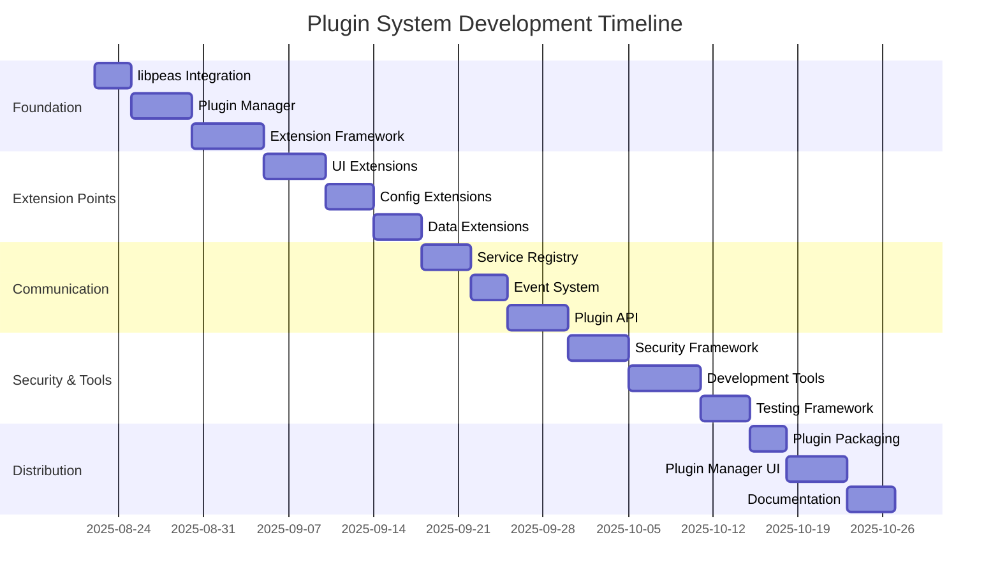
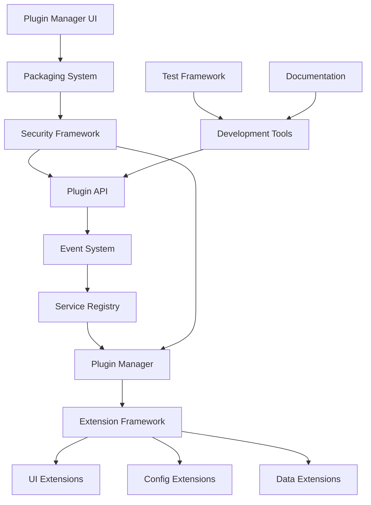

# Plugin System Development Work Breakdown

**Document:** 2025-08-22-plugin-system-development.md
**Version:** 1.0
**Status:** Draft

## Overview

This planning document outlines the implementation work required for Slate's plugin system, built on libpeas, including plugin infrastructure, extension points, development tools, and security framework.

## Project Phases

## Work Packages

### WP1: Plugin Foundation

#### WP1.1: libpeas Integration and Configuration

**Estimated Effort:** 3 days
**Priority:** Critical
**Dependencies:** Core Infrastructure

**Tasks:**

1. **Set up libpeas integration**

   - Configure libpeas dependency in build system
   - Set up plugin search paths and discovery
   - Implement basic plugin loading infrastructure
   - Create plugin metadata handling

2. **Configure plugin architecture**

   - Define plugin directory structure
   - Set up plugin manifest format
   - Create plugin versioning system
   - Implement plugin dependency resolution

3. **Create plugin utilities**

   - Implement plugin information extraction
   - Create plugin validation utilities
   - Set up plugin error handling
   - Implement plugin lifecycle management

4. **Set up plugin testing**
   - Create plugin testing framework
   - Implement plugin mock system
   - Set up plugin integration testing
   - Create plugin performance testing

**Deliverables:**

- libpeas integration complete
- Plugin architecture defined
- Basic plugin utilities
- Plugin testing framework

**Testing Requirements:**

- [ ] libpeas loads and initializes correctly
- [ ] Plugin discovery finds available plugins
- [ ] Plugin metadata parsing works correctly
- [ ] Plugin loading handles errors gracefully
- [ ] Plugin testing framework functions properly

#### WP1.2: Plugin Manager Implementation

**Estimated Effort:** 5 days
**Priority:** Critical
**Dependencies:** WP1.1

**Tasks:**

1. **Create SlatePluginManager**

   - Implement core plugin manager class
   - Add plugin enumeration and discovery
   - Create plugin lifecycle management
   - Implement plugin state tracking

2. **Add plugin loading system**

   - Implement safe plugin loading
   - Add plugin unloading capabilities
   - Create plugin reload functionality
   - Implement plugin crash recovery

3. **Create plugin configuration**

   - Implement plugin-specific configuration
   - Add plugin preference management
   - Create plugin configuration validation
   - Implement configuration persistence

4. **Add plugin communication**
   - Create plugin-to-core communication
   - Implement inter-plugin communication
   - Add plugin event system
   - Create plugin service registry

**Deliverables:**

- Complete plugin manager
- Plugin lifecycle management
- Plugin configuration system
- Plugin communication framework

**Testing Requirements:**

- [ ] Plugin manager loads and unloads plugins correctly
- [ ] Plugin state tracking is accurate
- [ ] Plugin configuration persists properly
- [ ] Plugin communication works reliably
- [ ] Plugin crash recovery functions correctly

#### WP1.3: Extension Framework Implementation

**Estimated Effort:** 6 days
**Priority:** Critical
**Dependencies:** WP1.2

**Tasks:**

1. **Create extension point system**

   - Implement extension point registration
   - Add extension point discovery
   - Create extension point validation
   - Implement extension point documentation

2. **Implement extension management**

   - Create extension registration system
   - Add extension activation/deactivation
   - Implement extension priority handling
   - Create extension conflict resolution

3. **Add extension interfaces**

   - Define standard extension interfaces
   - Implement extension interface validation
   - Create extension interface helpers
   - Add extension interface documentation

4. **Create extension utilities**
   - Implement extension discovery utilities
   - Add extension introspection tools
   - Create extension debugging support
   - Implement extension performance monitoring

**Deliverables:**

- Extension point system
- Extension management framework
- Standard extension interfaces
- Extension development utilities

**Testing Requirements:**

- [ ] Extension points register and function correctly
- [ ] Extension management handles all operations
- [ ] Extension interfaces validate properly
- [ ] Extension utilities provide useful functionality
- [ ] Extension performance is acceptable

### WP2: Extension Point Implementation

#### WP2.1: UI Extension Points

**Estimated Effort:** 5 days
**Priority:** High
**Dependencies:** WP1.3

**Tasks:**

1. **Implement header bar extensions**

   - Create header bar extension interface
   - Add action button registration
   - Implement title widget customization
   - Create menu item integration

2. **Create sidebar extensions**

   - Implement sidebar panel registration
   - Add panel content management
   - Create panel priority system
   - Implement panel context awareness

3. **Add content area extensions**

   - Create view registration system
   - Implement view lifecycle management
   - Add view navigation integration
   - Create view customization API

4. **Implement status bar extensions**
   - Create status widget registration
   - Add notification system integration
   - Implement progress indicator API
   - Create status message management

**Deliverables:**

- Header bar extension system
- Sidebar extension framework
- Content area extension points
- Status bar extension API

**Testing Requirements:**

- [ ] Header bar extensions integrate seamlessly
- [ ] Sidebar panels display and function correctly
- [ ] Content area views work properly
- [ ] Status bar widgets appear and update correctly
- [ ] All UI extensions respect themes and accessibility

#### WP2.2: Configuration Extension Points

**Estimated Effort:** 4 days
**Priority:** High
**Dependencies:** WP2.1, Configuration System

**Tasks:**

1. **Create schema extension system**

   - Implement plugin schema registration
   - Add schema validation integration
   - Create schema composition tools
   - Implement schema documentation

2. **Add configuration provider API**

   - Create configuration source registration
   - Implement configuration merging
   - Add configuration validation extension
   - Create configuration transformation API

3. **Implement configuration UI extensions**

   - Add preference panel registration
   - Create configuration widget system
   - Implement configuration validation UI
   - Add configuration editor extensions

4. **Create configuration tools**
   - Implement configuration introspection
   - Add configuration debugging tools
   - Create configuration export extensions
   - Implement configuration migration helpers

**Deliverables:**

- Schema extension system
- Configuration provider API
- Configuration UI extensions
- Configuration development tools

**Testing Requirements:**

- [ ] Plugin schemas integrate with validation
- [ ] Configuration providers work correctly
- [ ] Configuration UI extensions display properly
- [ ] Configuration tools provide useful functionality
- [ ] Configuration extensions don't conflict

#### WP2.3: Data Extension Points

**Estimated Effort:** 4 days
**Priority:** High
**Dependencies:** WP2.2

**Tasks:**

1. **Create data source extensions**

   - Implement data source registration API
   - Add data source lifecycle management
   - Create data source validation
   - Implement data source discovery

2. **Add data processor extensions**

   - Create data processor registration
   - Implement data processing pipeline
   - Add data transformation API
   - Create data processor chaining

3. **Implement data storage extensions**

   - Add data storage provider API
   - Create data persistence framework
   - Implement data indexing extensions
   - Add data export extensions

4. **Create data visualization extensions**
   - Implement widget registration system
   - Add chart type extensions
   - Create visualization customization API
   - Implement real-time data updates

**Deliverables:**

- Data source extension system
- Data processor framework
- Data storage extensions
- Data visualization API

**Testing Requirements:**

- [ ] Data sources provide data correctly
- [ ] Data processors transform data properly
- [ ] Data storage persists data reliably
- [ ] Data visualizations display correctly
- [ ] Real-time updates work smoothly

### WP3: Plugin Communication System

#### WP3.1: Service Registry Implementation

**Estimated Effort:** 4 days
**Priority:** High
**Dependencies:** WP2.3

**Tasks:**

1. **Create service registry framework**

   - Implement service registration system
   - Add service discovery mechanisms
   - Create service lifecycle management
   - Implement service versioning

2. **Add service interfaces**

   - Define standard service interfaces
   - Create service interface validation
   - Implement service proxy system
   - Add service interface documentation

3. **Implement service resolution**

   - Create service dependency injection
   - Add service factory system
   - Implement service singleton management
   - Create service configuration

4. **Add service monitoring**
   - Implement service health checking
   - Create service performance monitoring
   - Add service usage tracking
   - Implement service debugging tools

**Deliverables:**

- Service registry framework
- Service interface system
- Service resolution mechanisms
- Service monitoring tools

**Testing Requirements:**

- [ ] Service registration and discovery work correctly
- [ ] Service interfaces validate properly
- [ ] Service resolution handles dependencies
- [ ] Service monitoring provides useful data
- [ ] Service system performs well

#### WP3.2: Event System Implementation

**Estimated Effort:** 3 days
**Priority:** High
**Dependencies:** WP3.1

**Tasks:**

1. **Create event bus system**

   - Implement publish-subscribe mechanism
   - Add event type registration
   - Create event priority handling
   - Implement event filtering

2. **Add event management**

   - Create event subscription management
   - Implement event lifecycle tracking
   - Add event debugging support
   - Create event performance monitoring

3. **Implement event security**

   - Add event permission system
   - Create event sandboxing
   - Implement event validation
   - Add event audit logging

4. **Create event utilities**
   - Implement event testing utilities
   - Add event simulation tools
   - Create event documentation helpers
   - Implement event migration tools

**Deliverables:**

- Event bus system
- Event management framework
- Event security system
- Event development utilities

**Testing Requirements:**

- [ ] Event publishing and subscription work correctly
- [ ] Event filtering functions properly
- [ ] Event security prevents unauthorized access
- [ ] Event utilities aid development
- [ ] Event system performance is acceptable

#### WP3.3: Plugin API Development

**Estimated Effort:** 5 days
**Priority:** High
**Dependencies:** WP3.2

**Tasks:**

1. **Create core plugin API**

   - Define comprehensive plugin API
   - Implement API documentation system
   - Create API versioning framework
   - Add API compatibility checking

2. **Add language bindings**

   - Implement C language API
   - Create Vala language bindings
   - Add Python language support
   - Implement JavaScript bindings

3. **Create API utilities**

   - Implement API introspection tools
   - Add API testing utilities
   - Create API documentation generation
   - Implement API migration helpers

4. **Add API security**
   - Implement API permission system
   - Create API rate limiting
   - Add API audit logging
   - Implement API sandboxing

**Deliverables:**

- Comprehensive plugin API
- Multiple language bindings
- API development utilities
- API security framework

**Testing Requirements:**

- [ ] Plugin API provides complete functionality
- [ ] Language bindings work correctly
- [ ] API utilities aid development
- [ ] API security prevents abuse
- [ ] API documentation is comprehensive

### WP4: Security and Development Tools

#### WP4.1: Security Framework Implementation

**Estimated Effort:** 5 days
**Priority:** Critical
**Dependencies:** WP3.3

**Tasks:**

1. **Create permission system**

   - Implement capability-based permissions
   - Add permission inheritance
   - Create permission validation
   - Implement permission audit

2. **Add resource control**

   - Implement resource usage limits
   - Create resource monitoring
   - Add resource quota management
   - Implement resource cleanup

3. **Create sandboxing**

   - Implement plugin process isolation
   - Add filesystem access control
   - Create network access restrictions
   - Implement security policy enforcement

4. **Add security monitoring**
   - Create security event logging
   - Implement intrusion detection
   - Add security policy validation
   - Create security reporting tools

**Deliverables:**

- Permission system
- Resource control framework
- Plugin sandboxing
- Security monitoring tools

**Testing Requirements:**

- [ ] Permission system enforces access control
- [ ] Resource limits prevent abuse
- [ ] Sandboxing isolates plugins properly
- [ ] Security monitoring detects violations
- [ ] Security framework doesn't impact performance significantly

#### WP4.2: Development Tools Implementation

**Estimated Effort:** 6 days
**Priority:** Medium
**Dependencies:** WP4.1

**Tasks:**

1. **Create plugin scaffolding tools**

   - Implement plugin template generator
   - Add project structure creation
   - Create build system integration
   - Implement plugin metadata generation

2. **Add debugging tools**

   - Create plugin debugger integration
   - Implement plugin profiling tools
   - Add plugin state inspection
   - Create plugin communication tracing

3. **Implement testing tools**

   - Create plugin test framework
   - Add automated testing utilities
   - Implement plugin mocking system
   - Create integration test helpers

4. **Add documentation tools**
   - Implement API documentation generation
   - Create plugin documentation templates
   - Add documentation validation
   - Implement documentation publishing

**Deliverables:**

- Plugin scaffolding tools
- Debugging and profiling tools
- Plugin testing framework
- Documentation generation system

**Testing Requirements:**

- [ ] Scaffolding tools create working plugins
- [ ] Debugging tools provide useful information
- [ ] Testing framework enables thorough testing
- [ ] Documentation tools generate quality docs
- [ ] Development tools integrate with standard IDEs

#### WP4.3: Plugin Testing Framework

**Estimated Effort:** 4 days
**Priority:** Medium
**Dependencies:** WP4.2

**Tasks:**

1. **Create test infrastructure**

   - Implement plugin test runner
   - Add test isolation framework
   - Create test data management
   - Implement test result reporting

2. **Add test utilities**

   - Create plugin mock system
   - Implement test fixture management
   - Add assertion libraries
   - Create test data generators

3. **Implement test automation**

   - Create continuous testing integration
   - Add automated test discovery
   - Implement test coverage reporting
   - Create performance regression testing

4. **Add test validation**
   - Implement test quality checking
   - Create test completeness analysis
   - Add test maintenance tools
   - Implement test documentation validation

**Deliverables:**

- Plugin test infrastructure
- Test utilities and mocks
- Test automation system
- Test validation tools

**Testing Requirements:**

- [ ] Test framework runs all test types correctly
- [ ] Test utilities simplify test creation
- [ ] Test automation integrates with CI/CD
- [ ] Test validation ensures quality
- [ ] Test framework performance is acceptable

### WP5: Plugin Distribution and Management

#### WP5.1: Plugin Packaging System

**Estimated Effort:** 3 days
**Priority:** Medium
**Dependencies:** WP4.3

**Tasks:**

1. **Create packaging format**

   - Define plugin package format
   - Implement package creation tools
   - Add package validation
   - Create package signing system

2. **Add dependency management**

   - Implement dependency resolution
   - Create dependency validation
   - Add dependency conflict detection
   - Implement dependency update management

3. **Create installation system**

   - Implement package installation
   - Add installation validation
   - Create rollback mechanisms
   - Implement installation security

4. **Add packaging tools**
   - Create package building utilities
   - Implement package testing tools
   - Add package optimization
   - Create package documentation tools

**Deliverables:**

- Plugin packaging format
- Dependency management system
- Installation framework
- Packaging development tools

**Testing Requirements:**

- [ ] Package format handles all plugin types
- [ ] Dependency resolution works correctly
- [ ] Installation process is reliable
- [ ] Packaging tools create valid packages
- [ ] Package security is maintained

#### WP5.2: Plugin Manager UI Implementation

**Estimated Effort:** 5 days
**Priority:** Medium
**Dependencies:** WP5.1

**Tasks:**

1. **Create plugin browser**

   - Implement plugin discovery interface
   - Add plugin search and filtering
   - Create plugin information display
   - Implement plugin preview system

2. **Add plugin management**

   - Create plugin installation interface
   - Implement plugin update management
   - Add plugin removal capabilities
   - Create plugin configuration interface

3. **Implement plugin store**

   - Create plugin repository interface
   - Add plugin rating and reviews
   - Implement plugin categories
   - Create plugin recommendation system

4. **Add management tools**
   - Implement plugin troubleshooting
   - Create plugin performance monitoring
   - Add plugin backup and restore
   - Implement plugin import/export

**Deliverables:**

- Plugin browser interface
- Plugin management system
- Plugin store integration
- Plugin administration tools

**Testing Requirements:**

- [ ] Plugin browser displays information correctly
- [ ] Plugin management operations work reliably
- [ ] Plugin store integration functions properly
- [ ] Management tools provide useful functionality
- [ ] UI is intuitive and accessible

#### WP5.3: Documentation and Examples

**Estimated Effort:** 4 days
**Priority:** Medium
**Dependencies:** WP5.2

**Tasks:**

1. **Create developer documentation**

   - Write comprehensive API documentation
   - Create plugin development guides
   - Add code examples and tutorials
   - Implement documentation validation

2. **Add example plugins**

   - Create simple example plugins
   - Implement complex example scenarios
   - Add best practice examples
   - Create anti-pattern warnings

3. **Create user documentation**

   - Write plugin user guides
   - Create troubleshooting documentation
   - Add plugin management tutorials
   - Implement help system integration

4. **Add documentation tools**
   - Create documentation generation
   - Implement documentation testing
   - Add documentation search
   - Create documentation versioning

**Deliverables:**

- Comprehensive developer documentation
- Example plugins and tutorials
- User documentation and guides
- Documentation tools and validation

**Testing Requirements:**

- [ ] Documentation is accurate and complete
- [ ] Examples compile and run correctly
- [ ] User guides are clear and helpful
- [ ] Documentation tools function properly
- [ ] Documentation stays up-to-date

## Integration Points and Dependencies

### Component Integration Flow

### External Dependencies

- **libpeas:** Core plugin loading framework
- **GModule:** Dynamic module loading
- **libsoup:** HTTP for plugin repository access
- **libarchive:** Plugin package handling
- **Python/JavaScript engines:** Language runtime support

### System Integration Points

- **Configuration System:** Plugin configuration schemas
- **UI System:** Extension point integration
- **Dashboard System:** Plugin widget registration
- **Security System:** Permission and resource management

## Quality Standards

### Performance Requirements

- **Plugin Loading:** < 200ms per plugin
- **Extension Registration:** < 50ms per extension
- **Service Resolution:** < 10ms per service lookup
- **Event Processing:** < 5ms per event
- **Memory Overhead:** < 10MB per loaded plugin

### Security Requirements

- **Permission Enforcement:** 100% enforcement of declared permissions
- **Resource Limits:** Configurable and enforced limits
- **Sandboxing:** Process isolation for untrusted plugins
- **Audit Logging:** Complete audit trail of plugin actions

### Reliability Requirements

- **Plugin Isolation:** Plugin crashes don't affect core application
- **Error Recovery:** Graceful handling of plugin failures
- **State Consistency:** Consistent state despite plugin operations
- **Rollback Capability:** Ability to rollback problematic plugin installations

## Risk Management

### Technical Risks

1. **libpeas Limitations**

   - Risk: libpeas doesn't support required features
   - Mitigation: Evaluate libpeas capabilities early
   - Contingency: Custom plugin loader implementation

2. **Performance Impact**

   - Risk: Plugin system adds significant overhead
   - Mitigation: Performance testing throughout development
   - Contingency: Lazy loading and caching optimizations

3. **Security Vulnerabilities**
   - Risk: Plugins compromise application security
   - Mitigation: Comprehensive security framework
   - Contingency: Disable plugin system in secure modes

### Project Risks

1. **API Stability**

   - Risk: Frequent API changes break plugin compatibility
   - Mitigation: API versioning and compatibility layers
   - Contingency: Plugin migration tools

2. **Development Complexity**
   - Risk: Plugin development too complex for third-party developers
   - Mitigation: Comprehensive documentation and examples
   - Contingency: Simplified plugin API subset

## Testing Strategy

### Unit Testing

- **Plugin Manager:** All plugin lifecycle operations
- **Extension Framework:** Extension registration and activation
- **Security Framework:** Permission and resource enforcement
- **Communication System:** Service registry and event system

### Integration Testing

- **Plugin Loading:** Complete plugin loading and activation
- **Extension Points:** All extension types in realistic scenarios
- **Security Testing:** Security policy enforcement
- **Performance Testing:** Plugin system performance impact

### User Experience Testing

- **Plugin Development:** Developer experience with tools and API
- **Plugin Management:** User experience with plugin installation
- **Plugin Usage:** End-user experience with plugins
- **Error Handling:** User experience with plugin errors

## Success Criteria

### Functional Success Criteria

- [ ] Plugin system loads and manages plugins correctly
- [ ] All extension points function properly
- [ ] Plugin communication works reliably
- [ ] Security framework prevents unauthorized access
- [ ] Development tools enable productive plugin development

### Quality Success Criteria

- [ ] Performance requirements met
- [ ] Security requirements enforced
- [ ] Reliability requirements satisfied
- [ ] Documentation complete and accurate
- [ ] User experience testing positive

### Ecosystem Success Criteria

- [ ] Third-party developers can create plugins
- [ ] Plugin development process is straightforward
- [ ] Plugin distribution works smoothly
- [ ] Plugin ecosystem can grow sustainably
- [ ] Plugin quality can be maintained

## Resource Requirements

### Development Team

- **1 Senior Systems Developer:** Plugin architecture and core implementation
- **1 Security Specialist:** Security framework and sandboxing
- **1 API Developer:** Plugin API and language bindings
- **1 Tools Developer:** Development tools and testing framework

### External Resources

- **libpeas Documentation:** Plugin framework understanding
- **Security Frameworks:** Best practices for plugin security
- **Developer Community:** Feedback on plugin development experience

## Timeline and Milestones

### Milestone 1: Foundation (Week 1-2)

- libpeas integration complete
- Plugin manager functional
- Extension framework operational

### Milestone 2: Extension Points (Week 3-4)

- UI extensions working
- Configuration extensions functional
- Data extensions operational

### Milestone 3: Communication (Week 5-6)

- Service registry complete
- Event system functional
- Plugin API comprehensive

### Milestone 4: Security and Tools (Week 7-9)

- Security framework enforced
- Development tools complete
- Testing framework functional

### Milestone 5: Distribution (Week 10-11)

- Plugin packaging system working
- Plugin manager UI complete
- Documentation comprehensive

## Handoff Criteria

### Technical Handoff

- [ ] Plugin system architecture complete
- [ ] All extension points implemented
- [ ] Security framework enforced
- [ ] Development tools functional
- [ ] Testing coverage comprehensive

### Developer Experience Handoff

- [ ] Plugin API documented and stable
- [ ] Development tools streamline plugin creation
- [ ] Examples demonstrate best practices
- [ ] Documentation enables self-service development
- [ ] Testing framework validates plugin quality

### User Experience Handoff

- [ ] Plugin management UI intuitive
- [ ] Plugin installation reliable
- [ ] Plugin errors handled gracefully
- [ ] Plugin performance acceptable
- [ ] Plugin ecosystem foundation established

### Next Phase Readiness

- [ ] Dashboard plugins can be developed
- [ ] Configuration plugins work correctly
- [ ] Core plugins provide base functionality
- [ ] Plugin ecosystem growth framework ready
- [ ] Long-term maintenance plan established
