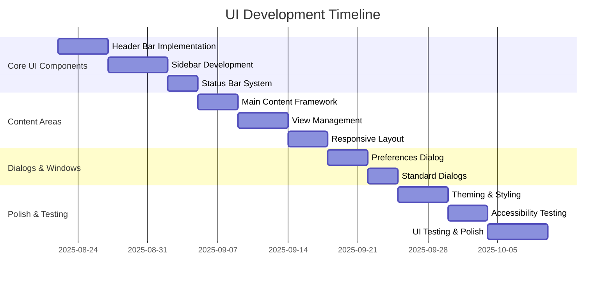
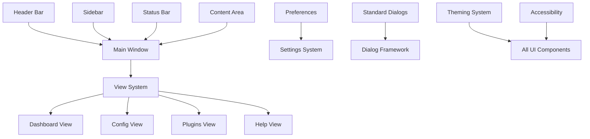

# User Interface Development Work Breakdown

**Document:** 2025-08-22-user-interface-development.md
**Version:** 1.0
**Status:** Draft

## Overview

This planning document outlines the development work required to implement the complete user interface system for Slate, including all major UI components, responsive design, and accessibility features.

## Project Phases

## Work Packages

### WP1: Core UI Components

#### WP1.1: Header Bar Implementation

**Estimated Effort:** 5 days
**Priority:** Critical
**Dependencies:** Core Infrastructure (WP1 from core-infrastructure.md)

**Tasks:**

1. **Create SlateHeaderBar component**

   - Implement custom header bar extending AdwHeaderBar
   - Set up proper layout with left, center, and right sections
   - Implement title and subtitle management
   - Add support for custom styling

2. **Implement action button system**

   - Create action button registration API
   - Implement button positioning and overflow handling
   - Set up action button tooltips and shortcuts
   - Create responsive button layout

3. **Add menu integration**

   - Implement primary menu button
   - Create menu model system
   - Set up dynamic menu item registration
   - Implement menu keyboard navigation

4. **Create view switcher integration**
   - Implement AdwViewSwitcher integration
   - Add responsive view switcher behavior
   - Set up view switcher customization
   - Create view switcher theming

**Deliverables:**

- Functional SlateHeaderBar component
- Action button registration system
- Integrated menu system
- Responsive view switcher

**Testing Requirements:**

- [ ] Header bar displays correctly in all themes
- [ ] Action buttons respond to clicks and keyboard
- [ ] Menu system navigable via keyboard
- [ ] View switcher adapts to window size
- [ ] Tooltips and shortcuts work correctly

#### WP1.2: Slideout Sidebar Development

**Estimated Effort:** 6 days
**Priority:** Critical
**Dependencies:** WP1.1

**Tasks:**

1. **Implement SlateSidebar component**

   - Create sidebar using AdwOverlaySplitView
   - Implement slideout animation and behavior
   - Set up sidebar state persistence
   - Create sidebar resize handling

2. **Create content panel system**

   - Implement panel registration API
   - Create panel priority and ordering system
   - Set up panel content lifecycle management
   - Implement panel search and filtering

3. **Add context-aware content**

   - Create selection-based content updates
   - Implement dynamic panel visibility
   - Set up panel content caching
   - Create panel refresh mechanisms

4. **Implement sidebar header**
   - Create collapsible sidebar header
   - Add close/minimize controls
   - Implement context title display
   - Set up header action buttons

**Deliverables:**

- Functional slideout sidebar
- Panel registration and management system
- Context-aware content updates
- Sidebar header with controls

**Testing Requirements:**

- [ ] Sidebar slides in/out smoothly
- [ ] Panel content updates correctly
- [ ] Sidebar state persists across sessions
- [ ] Keyboard navigation works in sidebar
- [ ] Sidebar adapts to different screen sizes

#### WP1.3: Status Bar System

**Estimated Effort:** 3 days
**Priority:** High
**Dependencies:** WP1.2

**Tasks:**

1. **Create SlateStatusBar component**

   - Implement status bar layout and structure
   - Set up status message display system
   - Create progress indicator integration
   - Implement status icon management

2. **Add notification system**

   - Create notification queue management
   - Implement notification display and auto-hide
   - Set up notification action buttons
   - Create notification history

3. **Implement connection status**

   - Create connection indicator widgets
   - Set up status update mechanisms
   - Implement tooltip information display
   - Create connection management interface

4. **Add plugin integration points**
   - Create status widget registration API
   - Implement widget priority system
   - Set up overflow handling for many widgets
   - Create status widget configuration

**Deliverables:**

- Functional status bar with message display
- Notification system
- Connection status indicators
- Plugin integration API

**Testing Requirements:**

- [ ] Status messages display correctly
- [ ] Progress indicators work smoothly
- [ ] Notifications appear and disappear properly
- [ ] Connection status updates in real-time
- [ ] Plugin widgets integrate seamlessly

### WP2: Content Area Development

#### WP2.1: Main Content Framework

**Estimated Effort:** 4 days
**Priority:** Critical
**Dependencies:** WP1.3

**Tasks:**

1. **Create content area container**

   - Implement main content area layout
   - Set up content area sizing and constraints
   - Create content area theming support
   - Implement content area accessibility

2. **Add content type management**

   - Create content type registration system
   - Implement content switching mechanisms
   - Set up content state management
   - Create content error handling

3. **Implement content loading**

   - Create asynchronous content loading
   - Implement loading indicators
   - Set up content caching system
   - Create content refresh mechanisms

4. **Add content navigation**
   - Implement content-specific navigation
   - Create navigation history management
   - Set up navigation keyboard shortcuts
   - Implement navigation state persistence

**Deliverables:**

- Content area framework
- Content type management system
- Asynchronous content loading
- Content navigation system

**Testing Requirements:**

- [ ] Content areas load correctly
- [ ] Content switching works smoothly
- [ ] Loading indicators appear appropriately
- [ ] Navigation state persists correctly
- [ ] Keyboard navigation works in content areas

#### WP2.2: View Management System

**Estimated Effort:** 5 days
**Priority:** Critical
**Dependencies:** WP2.1

**Tasks:**

1. **Implement view controller**

   - Create view lifecycle management
   - Implement view state synchronization
   - Set up view data binding
   - Create view validation system

2. **Create standard views**

   - Implement Dashboard view structure
   - Create Configuration Editor view
   - Set up Plugins management view
   - Implement Help and documentation view

3. **Add view transitions**

   - Implement smooth view transitions
   - Create transition animation system
   - Set up view transition state management
   - Implement transition accessibility

4. **Implement view customization**
   - Create view layout customization
   - Set up view toolbar management
   - Implement view action integration
   - Create view settings persistence

**Deliverables:**

- View controller system
- Standard application views
- Smooth view transitions
- View customization framework

**Testing Requirements:**

- [ ] All standard views display correctly
- [ ] View transitions are smooth and accessible
- [ ] View state persists across switches
- [ ] View customization works properly
- [ ] View keyboard navigation functions

#### WP2.3: Responsive Layout System

**Estimated Effort:** 4 days
**Priority:** High
**Dependencies:** WP2.2

**Tasks:**

1. **Implement responsive breakpoints**

   - Define breakpoint system for different screen sizes
   - Create breakpoint detection and handling
   - Implement layout adaptation mechanisms
   - Set up responsive testing utilities

2. **Create adaptive layouts**

   - Implement mobile-friendly layouts
   - Create tablet-optimized layouts
   - Set up desktop layout optimization
   - Implement layout transition animations

3. **Add responsive navigation**

   - Create mobile navigation patterns
   - Implement collapsible navigation elements
   - Set up adaptive menu systems
   - Create touch-friendly navigation

4. **Implement responsive content**
   - Create content scaling mechanisms
   - Implement adaptive content layouts
   - Set up responsive image handling
   - Create adaptive typography

**Deliverables:**

- Responsive breakpoint system
- Adaptive layouts for all screen sizes
- Responsive navigation patterns
- Adaptive content display

**Testing Requirements:**

- [ ] Layout adapts correctly to different screen sizes
- [ ] Navigation works on mobile devices
- [ ] Content scales appropriately
- [ ] Touch interactions work properly
- [ ] Responsive transitions are smooth

### WP3: Dialogs and Windows

#### WP3.1: Preferences Dialog System

**Estimated Effort:** 4 days
**Priority:** High
**Dependencies:** WP2.3

**Tasks:**

1. **Create preferences window**

   - Implement AdwPreferencesWindow
   - Set up preference categories and groups
   - Create preference search functionality
   - Implement preference navigation

2. **Add preference controls**

   - Create standard preference control widgets
   - Implement preference validation
   - Set up preference data binding
   - Create preference reset functionality

3. **Implement plugin preferences**

   - Create plugin preference integration
   - Set up plugin preference isolation
   - Implement plugin preference validation
   - Create plugin preference documentation

4. **Add preference import/export**
   - Implement preference backup system
   - Create preference export functionality
   - Set up preference import validation
   - Implement preference synchronization

**Deliverables:**

- Comprehensive preferences dialog
- Standard preference controls
- Plugin preference integration
- Preference backup and restore

**Testing Requirements:**

- [ ] Preferences dialog opens and navigates correctly
- [ ] All preference controls function properly
- [ ] Plugin preferences integrate seamlessly
- [ ] Preference backup/restore works correctly
- [ ] Preference search finds relevant settings

#### WP3.2: Standard Dialog System

**Estimated Effort:** 3 days
**Priority:** High
**Dependencies:** WP3.1

**Tasks:**

1. **Create dialog framework**

   - Implement standard dialog base classes
   - Set up dialog lifecycle management
   - Create dialog accessibility features
   - Implement dialog keyboard navigation

2. **Implement common dialogs**

   - Create file chooser dialog integration
   - Implement confirmation dialog system
   - Set up error dialog framework
   - Create about dialog

3. **Add dialog customization**

   - Create custom dialog creation API
   - Implement dialog theming support
   - Set up dialog action button management
   - Create dialog validation framework

4. **Implement dialog state management**
   - Create dialog state persistence
   - Set up dialog result handling
   - Implement dialog cancellation
   - Create dialog timeout handling

**Deliverables:**

- Standard dialog framework
- Common application dialogs
- Dialog customization API
- Dialog state management

**Testing Requirements:**

- [ ] All standard dialogs display correctly
- [ ] Dialog navigation works via keyboard
- [ ] Dialog actions function properly
- [ ] Dialog state persists appropriately
- [ ] Dialog accessibility features work

### WP4: Theming and Polish

#### WP4.1: Theming and Styling System

**Estimated Effort:** 5 days
**Priority:** High
**Dependencies:** WP3.2

**Tasks:**

1. **Implement theme management**

   - Create theme switching infrastructure
   - Set up light/dark theme support
   - Implement custom theme loading
   - Create theme validation system

2. **Create custom styling**

   - Implement application-specific CSS
   - Create component styling system
   - Set up brand color integration
   - Implement styling customization API

3. **Add theme persistence**

   - Create theme preference storage
   - Implement theme auto-detection
   - Set up theme synchronization
   - Create theme preview system

4. **Implement dynamic theming**
   - Create runtime theme switching
   - Set up theme change animations
   - Implement theme-aware icons
   - Create theme compatibility checking

**Deliverables:**

- Complete theme management system
- Custom application styling
- Theme persistence and synchronization
- Dynamic theme switching

**Testing Requirements:**

- [ ] Light and dark themes work correctly
- [ ] Theme switching is smooth and complete
- [ ] Custom styling displays properly
- [ ] Theme preferences persist correctly
- [ ] Theme-aware icons update properly

#### WP4.2: Accessibility Implementation

**Estimated Effort:** 4 days
**Priority:** Critical
**Dependencies:** WP4.1

**Tasks:**

1. **Implement keyboard accessibility**

   - Create comprehensive keyboard navigation
   - Set up proper focus management
   - Implement keyboard shortcuts
   - Create focus indicators

2. **Add screen reader support**

   - Implement proper ARIA labels
   - Set up accessible descriptions
   - Create accessible state announcements
   - Implement accessible navigation

3. **Create visual accessibility**

   - Implement high contrast mode support
   - Set up scalable UI elements
   - Create color-blind friendly design
   - Implement reduced motion support

4. **Add accessibility testing**
   - Create accessibility test suite
   - Set up automated accessibility checking
   - Implement accessibility reporting
   - Create accessibility documentation

**Deliverables:**

- Comprehensive keyboard accessibility
- Screen reader compatibility
- Visual accessibility features
- Accessibility testing framework

**Testing Requirements:**

- [ ] All UI elements accessible via keyboard
- [ ] Screen readers announce content properly
- [ ] High contrast mode works correctly
- [ ] UI scales properly for vision needs
- [ ] Accessibility tests pass completely

#### WP4.3: UI Testing and Polish

**Estimated Effort:** 6 days
**Priority:** High
**Dependencies:** WP4.2

**Tasks:**

1. **Create UI test framework**

   - Set up automated UI testing
   - Create UI test utilities
   - Implement visual regression testing
   - Set up performance testing

2. **Implement interaction testing**

   - Create user interaction tests
   - Set up gesture and touch testing
   - Implement navigation testing
   - Create error scenario testing

3. **Add visual polish**

   - Implement consistent spacing and alignment
   - Create smooth animations and transitions
   - Set up proper loading states
   - Implement visual feedback systems

4. **Perform user experience testing**
   - Conduct usability testing sessions
   - Implement user feedback collection
   - Create UX improvement tracking
   - Set up continuous UX monitoring

**Deliverables:**

- Comprehensive UI test suite
- Interaction testing framework
- Visual polish and consistency
- UX testing and feedback system

**Testing Requirements:**

- [ ] All UI tests pass consistently
- [ ] Visual regression tests detect changes
- [ ] Interaction tests cover all scenarios
- [ ] Performance tests meet requirements
- [ ] User experience meets usability standards

## Integration and Dependencies

### Component Integration Flow

### External UI Dependencies

- **GTK4:** Core widget toolkit
- **Libadwaita:** Modern GNOME widgets and patterns
- **GtkSourceView:** Syntax highlighting for code editors
- **Cairo/Pango:** Graphics and text rendering

## Quality Standards

### Visual Design Standards

- **Consistency:** All components follow Libadwaita design patterns
- **Accessibility:** WCAG 2.1 AA compliance minimum
- **Performance:** Smooth 60fps animations and transitions
- **Responsiveness:** Support for 640px to 4K+ displays

### Code Quality Standards

- **Documentation:** All public UI APIs documented
- **Testing:** 90% test coverage for UI components
- **Accessibility:** All components keyboard navigable
- **Internationalization:** All UI text translatable

## Risk Management

### Technical Risks

1. **GTK4/Libadwaita Breaking Changes**

   - Risk: API changes breaking UI components
   - Mitigation: Pin library versions, test with multiple versions
   - Contingency: Maintain compatibility layers

2. **Performance Issues**

   - Risk: UI sluggishness with complex layouts
   - Mitigation: Performance testing throughout development
   - Contingency: Optimize critical paths, simplify complex components

3. **Accessibility Compliance**
   - Risk: Missing accessibility features
   - Mitigation: Accessibility testing from day one
   - Contingency: Dedicated accessibility sprint

### Project Risks

1. **Design Consistency**

   - Risk: Inconsistent UI patterns across components
   - Mitigation: Design system documentation and review
   - Contingency: UI audit and standardization phase

2. **Responsive Design Complexity**
   - Risk: Complex responsive behavior difficult to maintain
   - Mitigation: Simple, well-tested breakpoint system
   - Contingency: Simplify responsive requirements

## Success Criteria

### Functional Success Criteria

- [ ] All UI components render correctly
- [ ] Navigation system works intuitively
- [ ] Responsive design adapts to all screen sizes
- [ ] All dialogs and windows function properly
- [ ] Theming system works completely

### Quality Success Criteria

- [ ] Accessibility compliance achieved
- [ ] Performance requirements met
- [ ] Visual consistency maintained
- [ ] User experience testing positive
- [ ] All automated tests passing

### User Experience Success Criteria

- [ ] Intuitive navigation and interaction
- [ ] Consistent visual design
- [ ] Smooth animations and transitions
- [ ] Accessible to users with disabilities
- [ ] Works well on different screen sizes

## Resource Requirements

### Development Team

- **1 UI/UX Developer:** Lead UI implementation and design
- **1 Frontend Developer:** Component implementation and testing
- **1 Accessibility Specialist:** Accessibility implementation and testing

### Design Resources

- **Design System:** Libadwaita-based design patterns
- **Icons:** Adwaita icon theme with custom additions
- **Typography:** System fonts with proper scaling
- **Colors:** Libadwaita semantic color palette

### Testing Resources

- **Devices:** Various screen sizes and input methods
- **Accessibility Tools:** Screen readers, contrast analyzers
- **Performance Tools:** Profiling and benchmarking tools

## Timeline and Milestones

### Milestone 1: Core Components (Week 1-2)

- Header bar functional
- Sidebar implementation complete
- Status bar working
- Basic navigation operational

### Milestone 2: Content Framework (Week 3)

- Content area framework complete
- View management system working
- Responsive layout functional

### Milestone 3: Dialogs and Windows (Week 4)

- Preferences dialog complete
- Standard dialogs implemented
- Dialog framework functional

### Milestone 4: Polish and Testing (Week 5-6)

- Theming system complete
- Accessibility features implemented
- All testing complete
- UI polish finalized

## Handoff Criteria

### Technical Handoff

- [ ] All UI components implemented and tested
- [ ] Documentation complete and up-to-date
- [ ] Test suite comprehensive and passing
- [ ] Performance requirements met
- [ ] Accessibility compliance verified

### User Experience Handoff

- [ ] Design system documented
- [ ] User interaction patterns consistent
- [ ] Accessibility features complete
- [ ] Responsive design tested
- [ ] User feedback incorporated

### Next Phase Readiness

- [ ] Plugin integration points available
- [ ] Configuration system UI ready
- [ ] Dashboard framework prepared
- [ ] Extension APIs documented
- [ ] Development environment setup guides complete
