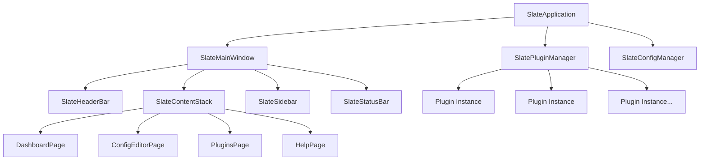

# Core Application Architecture Specification

**Document:** 2025-08-22-core-application-architecture.md
**Version:** 1.0
**Status:** Draft

## Overview

This specification defines the core architecture of the Slate application framework, including the main application structure, window management, navigation patterns, and overall system design principles.

## Purpose

Slate is designed to be a simple, configurable, and highly extensible desktop application framework that serves as the spiritual successor to Dactl. It provides a foundation for building measurement and control applications with modern UI patterns and a robust plugin system.

## Technical Requirements

### Technology Stack

- **UI Framework:** GTK4 with Libadwaita
- **Primary Language:** Vala for application code
- **Library Language:** C with GObject type system
- **Plugin System:** libpeas
- **Configuration Format:** HCL (HashiCorp Configuration Language)
- **Build System:** Meson

### Platform Support

- **Primary:** Linux (GNOME ecosystem)
- **Secondary:** macOS and Windows (future goals)

## Architecture Overview

## Core Components

### SlateApplication

- **Purpose:** Main application class extending `AdwApplication`
- **Responsibilities:**
  - Application lifecycle management
  - Command-line argument processing
  - Plugin system initialization
  - Configuration loading
  - Window management

### SlateMainWindow

- **Purpose:** Primary application window extending `AdwApplicationWindow`
- **Responsibilities:**
  - Overall layout management
  - Component coordination
  - State management
  - Event routing

### Navigation Architecture

The application uses a stack-based navigation pattern with the following pages:

- **Dashboard:** Project rendering and visualization
- **Configuration Editor:** HCL config editing with graphical and text views
- **Plugins:** Plugin management interface
- **Help:** Documentation and user assistance

## Design Patterns

### Component Communication

- Use GObject signals for loose coupling between components
- Implement observer pattern for state changes
- Use GActions for user-initiated operations

### State Management

- Centralized application state in `SlateApplication`
- Component-specific state in individual components
- Plugin state isolation

### Error Handling

- Use GError for recoverable errors
- Implement graceful fallbacks for plugin failures
- Comprehensive logging using GLib logging

## Performance Requirements

### Startup Time

- Target: < 2 seconds on modern hardware
- Strategy: Lazy loading of non-essential components

### Memory Usage

- Target: < 50MB baseline memory footprint
- Strategy: Efficient widget creation and destruction

### Responsiveness

- All UI operations must remain responsive
- Long-running operations must use background threads
- Progress indication for operations > 1 second

## Extensibility Requirements

### Plugin Integration Points

- Header bar customization
- Sidebar content injection
- Main content area pages
- Status bar widgets
- Menu items
- Configuration providers

### Configuration System

- Support for hierarchical configuration
- Plugin-specific configuration sections
- Runtime configuration changes
- Configuration validation

## Security Considerations

### Plugin Sandboxing

- Plugins run in the same process but with defined interfaces
- No direct file system access outside designated areas
- Configuration access through controlled APIs

### Configuration Security

- Validation of all configuration inputs
- Sanitization of user-provided data
- Secure defaults for all settings

## Compatibility Requirements

### GTK4/Libadwaita Compliance

- Follow GNOME Human Interface Guidelines
- Support both light and dark themes
- Responsive design for different window sizes
- Accessibility compliance

### Cross-Platform Considerations

- Use portable GLib/GTK constructs
- Avoid platform-specific code in core
- Plugin system must support platform differences

## Testing Strategy

### Unit Testing

- Core component functionality
- Configuration parsing and validation
- Plugin system APIs

### Integration Testing

- Component interaction
- Plugin loading and communication
- Configuration system end-to-end

### UI Testing

- Automated UI testing where possible
- Manual testing for complex interactions
- Accessibility testing

## Future Considerations

### Scalability

- Support for large configuration files
- Efficient handling of many plugins
- Performance with complex dashboards

### Maintenance

- Clear separation of concerns
- Comprehensive documentation
- Automated testing pipeline
- Regular dependency updates

## Success Criteria

1. Application starts successfully with no plugins
2. Plugin system can load and unload plugins dynamically
3. Configuration system can parse and validate HCL files
4. All UI components render correctly in light and dark themes
5. Application remains responsive during normal operations
6. Memory usage stays within defined limits
7. All public APIs are properly documented
