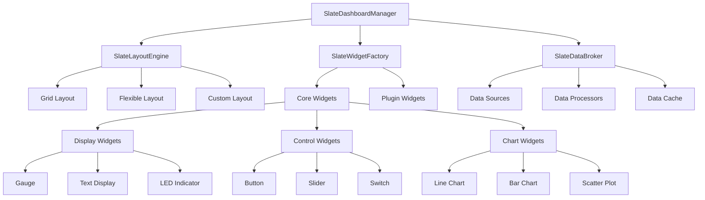

# Dashboard System Specification

**Document:** 2025-08-22-dashboard-system.md
**Version:** 1.0
**Status:** Draft

## Overview

This specification defines the dashboard system for Slate, which provides a flexible, configurable interface for visualizing data and controlling connected systems through a widget-based layout system.

## Purpose

Create a powerful dashboard system that allows users to build custom interfaces for monitoring and controlling various systems, with support for real-time data display, interactive controls, and extensible widget types through the plugin system.

## Dashboard Architecture



## Core Components

### SlateDashboardManager

#### Purpose

Central dashboard management system that coordinates layout, widgets, data flow, and user interactions.

#### Responsibilities

- Dashboard configuration loading and parsing
- Layout management and widget placement
- Data source coordination
- Widget lifecycle management
- User interaction handling
- State persistence

#### API Design

```c
// Dashboard management
SlateDashboard* slate_dashboard_new(void);
gboolean slate_dashboard_load_from_config(SlateDashboard* dashboard, SlateConfig* config, GError** error);
gboolean slate_dashboard_save_to_config(SlateDashboard* dashboard, SlateConfig* config, GError** error);

// Layout management
void slate_dashboard_set_layout(SlateDashboard* dashboard, SlateLayout* layout);
SlateLayout* slate_dashboard_get_layout(SlateDashboard* dashboard);

// Widget management
gboolean slate_dashboard_add_widget(SlateDashboard* dashboard, SlateWidget* widget, SlateWidgetPosition* position);
gboolean slate_dashboard_remove_widget(SlateDashboard* dashboard, const char* widget_id);
SlateWidget* slate_dashboard_get_widget(SlateDashboard* dashboard, const char* widget_id);
GList* slate_dashboard_get_all_widgets(SlateDashboard* dashboard);

// Data binding
gboolean slate_dashboard_bind_data_source(SlateDashboard* dashboard, const char* widget_id, const char* data_source_id);
void slate_dashboard_update_data(SlateDashboard* dashboard, const char* data_source_id, GVariant* data);
```

### Layout System

#### Layout Types

##### Grid Layout

```c
typedef struct {
    int columns;
    int rows;
    int spacing;
    gboolean uniform_sizing;
} SlateGridLayoutConfig;

typedef struct {
    int column;
    int row;
    int column_span;
    int row_span;
} SlateGridPosition;
```

##### Flexible Layout

```c
typedef struct {
    SlateFlexDirection direction;  // row, column
    SlateFlexWrap wrap;           // wrap, nowrap
    SlateFlexJustify justify;     // start, center, end, space-between
    SlateFlexAlign align;         // start, center, end, stretch
    int gap;
} SlateFlexLayoutConfig;

typedef struct {
    int flex_grow;
    int flex_shrink;
    int flex_basis;
    SlateFlexAlign align_self;
} SlateFlexPosition;
```

##### Custom Layout

```c
typedef struct {
    double x;
    double y;
    double width;
    double height;
    SlatePositionUnit unit;  // pixels, percentage
} SlateAbsolutePosition;
```

#### Layout Manager Interface

```c
typedef struct _SlateLayoutManager SlateLayoutManager;
typedef struct _SlateLayoutManagerInterface SlateLayoutManagerInterface;

struct _SlateLayoutManagerInterface {
    GTypeInterface parent_interface;

    // Layout calculation
    void (*calculate_layout)(SlateLayoutManager* manager, GtkAllocation* available_space);

    // Widget positioning
    GtkAllocation (*get_widget_allocation)(SlateLayoutManager* manager, const char* widget_id);
    void (*set_widget_position)(SlateLayoutManager* manager, const char* widget_id, SlateWidgetPosition* position);

    // Layout validation
    gboolean (*validate_position)(SlateLayoutManager* manager, SlateWidgetPosition* position);
};
```

### Widget System

#### Base Widget Interface

```c
typedef struct _SlateWidget SlateWidget;
typedef struct _SlateWidgetInterface SlateWidgetInterface;

struct _SlateWidgetInterface {
    GTypeInterface parent_interface;

    // Widget lifecycle
    void (*initialize)(SlateWidget* widget, GVariant* config);
    void (*configure)(SlateWidget* widget, GVariant* config);
    void (*destroy)(SlateWidget* widget);

    // Data handling
    void (*set_data)(SlateWidget* widget, GVariant* data);
    GVariant* (*get_data)(SlateWidget* widget);

    // UI management
    GtkWidget* (*get_gtk_widget)(SlateWidget* widget);
    void (*update_appearance)(SlateWidget* widget);

    // Configuration
    GVariant* (*get_config_schema)(SlateWidget* widget);
    gboolean (*validate_config)(SlateWidget* widget, GVariant* config);
};

#define SLATE_TYPE_WIDGET (slate_widget_get_type())
G_DECLARE_INTERFACE(SlateWidget, slate_widget, SLATE, WIDGET, GObject)
```

#### Display Widgets

##### Gauge Widget

```c
typedef struct {
    double min_value;
    double max_value;
    double current_value;
    char* units;
    char* title;
    SlateGaugeStyle style;     // circular, linear, arc
    gboolean show_value;
    gboolean show_limits;
    GdkRGBA color_normal;
    GdkRGBA color_warning;
    GdkRGBA color_critical;
    double warning_threshold;
    double critical_threshold;
} SlateGaugeConfig;
```

##### Text Display Widget

```c
typedef struct {
    char* format_string;       // printf-style format
    char* prefix;
    char* suffix;
    char* units;
    SlateTextAlignment alignment;
    SlateTextSize size;
    GdkRGBA color;
    gboolean auto_scale_font;
} SlateTextDisplayConfig;
```

##### LED Indicator Widget

```c
typedef struct {
    SlateLEDShape shape;       // circle, square, diamond
    SlateLEDSize size;         // small, medium, large
    GdkRGBA color_on;
    GdkRGBA color_off;
    gboolean blink_enabled;
    int blink_rate_ms;
    char* label;
    SlateLabelPosition label_position;
} SlateLEDConfig;
```

#### Control Widgets

##### Button Widget

```c
typedef struct {
    char* label;
    char* icon_name;
    SlateButtonStyle style;    // normal, suggested, destructive
    SlateButtonSize size;      // small, normal, large
    char* action_command;      // Command to execute
    GVariant* action_data;     // Data to send with action
    gboolean confirmation_required;
    char* confirmation_message;
} SlateButtonConfig;
```

##### Slider Widget

```c
typedef struct {
    double min_value;
    double max_value;
    double current_value;
    double step_increment;
    double page_increment;
    SlateSliderOrientation orientation;
    gboolean show_value;
    gboolean show_marks;
    gboolean discrete_values;
    char* units;
    SlateSliderUpdateMode update_mode; // continuous, discrete, on_release
} SlateSliderConfig;
```

##### Switch Widget

```c
typedef struct {
    gboolean current_state;
    char* label_on;
    char* label_off;
    char* description;
    gboolean confirmation_required;
    char* confirmation_message;
    SlateToggleStyle style;    // switch, checkbox, radio
} SlateSwitchConfig;
```

#### Chart Widgets

##### Line Chart Widget

```c
typedef struct {
    char* title;
    char* x_axis_label;
    char* y_axis_label;
    double x_min, x_max;
    double y_min, y_max;
    gboolean auto_scale_x;
    gboolean auto_scale_y;
    gboolean show_grid;
    gboolean show_legend;
    int max_data_points;
    SlateChartTimeRange time_range;
    GList* data_series;        // List of SlateDataSeries
} SlateLineChartConfig;

typedef struct {
    char* name;
    GdkRGBA color;
    SlateLineStyle line_style; // solid, dashed, dotted
    int line_width;
    gboolean show_points;
    SlatePointStyle point_style;
    char* data_source_id;
} SlateDataSeries;
```

### Data Management

#### Data Broker System

```c
typedef struct _SlateDataBroker SlateDataBroker;

// Data source management
void slate_data_broker_register_source(SlateDataBroker* broker, const char* source_id, SlateDataSource* source);
void slate_data_broker_unregister_source(SlateDataBroker* broker, const char* source_id);

// Data subscription
gulong slate_data_broker_subscribe(SlateDataBroker* broker, const char* source_id, SlateDataCallback callback, gpointer user_data);
void slate_data_broker_unsubscribe(SlateDataBroker* broker, gulong subscription_id);

// Data publishing
void slate_data_broker_publish_data(SlateDataBroker* broker, const char* source_id, GVariant* data, guint64 timestamp);

// Data querying
GVariant* slate_data_broker_query_current(SlateDataBroker* broker, const char* source_id);
GVariant* slate_data_broker_query_history(SlateDataBroker* broker, const char* source_id, guint64 start_time, guint64 end_time);
```

#### Data Source Interface

```c
typedef struct _SlateDataSource SlateDataSource;
typedef struct _SlateDataSourceInterface SlateDataSourceInterface;

struct _SlateDataSourceInterface {
    GTypeInterface parent_interface;

    // Data source lifecycle
    gboolean (*start)(SlateDataSource* source, GError** error);
    void (*stop)(SlateDataSource* source);
    gboolean (*is_active)(SlateDataSource* source);

    // Data access
    GVariant* (*read_current)(SlateDataSource* source);
    GVariant* (*read_history)(SlateDataSource* source, guint64 start_time, guint64 end_time);

    // Configuration
    void (*configure)(SlateDataSource* source, GVariant* config);
    GVariant* (*get_metadata)(SlateDataSource* source);
};

#define SLATE_TYPE_DATA_SOURCE (slate_data_source_get_type())
G_DECLARE_INTERFACE(SlateDataSource, slate_data_source, SLATE, DATA_SOURCE, GObject)
```

#### Data Processing Pipeline

```c
typedef struct _SlateDataProcessor SlateDataProcessor;
typedef struct _SlateDataProcessorInterface SlateDataProcessorInterface;

struct _SlateDataProcessorInterface {
    GTypeInterface parent_interface;

    // Data processing
    GVariant* (*process_data)(SlateDataProcessor* processor, GVariant* input_data);

    // Configuration
    void (*configure)(SlateDataProcessor* processor, GVariant* config);
    GVariant* (*get_config_schema)(SlateDataProcessor* processor);
};

// Common data processors
typedef enum {
    SLATE_DATA_PROCESSOR_FILTER,      // Low-pass, high-pass, band-pass filters
    SLATE_DATA_PROCESSOR_SCALE,       // Linear scaling and unit conversion
    SLATE_DATA_PROCESSOR_AGGREGATE,   // Min, max, average, sum operations
    SLATE_DATA_PROCESSOR_SMOOTH,      // Moving average, exponential smoothing
    SLATE_DATA_PROCESSOR_THRESHOLD,   // Threshold detection and alarming
    SLATE_DATA_PROCESSOR_CUSTOM       // Plugin-defined processors
} SlateDataProcessorType;
```

## Dashboard Configuration

### Configuration Schema

```hcl
dashboard {
  title = "Main Control Dashboard"

  layout {
    type = "grid"
    columns = 4
    rows = 3
    spacing = 10
    uniform_sizing = true
  }

  # Temperature gauge
  widget "temperature_gauge" {
    type = "gauge"
    position {
      column = 1
      row = 1
    }

    data_source = "sensors.temperature"

    config {
      min_value = 0
      max_value = 100
      units = "°C"
      title = "Temperature"
      style = "circular"
      warning_threshold = 75
      critical_threshold = 90
      color_normal = "#4CAF50"
      color_warning = "#FF9800"
      color_critical = "#F44336"
    }
  }

  # Pressure control
  widget "pressure_control" {
    type = "slider"
    position {
      column = 2
      row = 1
    }

    data_source = "controls.pressure"

    config {
      min_value = 0
      max_value = 10
      step_increment = 0.1
      units = "bar"
      orientation = "horizontal"
      update_mode = "on_release"
    }
  }

  # System status
  widget "system_status" {
    type = "led"
    position {
      column = 3
      row = 1
    }

    data_source = "system.status"

    config {
      shape = "circle"
      size = "large"
      label = "System OK"
      label_position = "bottom"
      color_on = "#4CAF50"
      color_off = "#757575"
    }
  }

  # Historical data chart
  widget "temperature_history" {
    type = "line_chart"
    position {
      column = 1
      row = 2
      column_span = 3
    }

    config {
      title = "Temperature History"
      x_axis_label = "Time"
      y_axis_label = "Temperature (°C)"
      time_range = "1h"
      auto_scale_y = true
      show_grid = true

      series "temperature" {
        name = "Temperature"
        data_source = "sensors.temperature"
        color = "#2196F3"
        line_style = "solid"
        line_width = 2
      }
    }
  }
}
```

### Runtime Configuration

```c
// Dashboard runtime configuration
typedef struct {
    gboolean auto_refresh_enabled;
    int refresh_rate_ms;
    gboolean fullscreen_mode;
    gboolean edit_mode_enabled;
    SlateTheme theme;
    double ui_scale_factor;
} SlateDashboardRuntimeConfig;
```

## User Interaction

### Edit Mode

- Widget selection and highlighting
- Drag-and-drop repositioning
- Property panel for configuration
- Add/remove widgets interface
- Layout modification tools

### Runtime Mode

- Normal operation with data display
- Interactive control widgets
- Context menus for quick actions
- Keyboard shortcuts for common operations

### Responsive Design

- Automatic layout adaptation for different screen sizes
- Widget scaling based on available space
- Overflow handling for complex layouts
- Mobile-friendly touch interactions

## Performance Optimization

### Rendering Performance

- Efficient widget update mechanisms
- Selective redrawing for changed widgets
- GPU acceleration where available
- Frame rate limiting for smooth animation

### Data Performance

- Data caching strategies
- Efficient data structure updates
- Background data processing
- Memory usage optimization

### Real-time Considerations

- Low-latency data updates
- Predictable update intervals
- Thread safety for concurrent access
- Buffering strategies for high-frequency data

## Plugin Integration

### Widget Plugin Interface

```c
// Widget plugin registration
gboolean slate_dashboard_register_widget_type(
    SlateDashboard* dashboard,
    const char* widget_type,
    GType widget_gtype,
    SlateWidgetFactory factory_func
);

// Custom widget factory
typedef SlateWidget* (*SlateWidgetFactory)(GVariant* config, GError** error);
```

### Data Source Plugins

```c
// Data source plugin registration
gboolean slate_dashboard_register_data_source_type(
    SlateDashboard* dashboard,
    const char* source_type,
    GType source_gtype,
    SlateDataSourceFactory factory_func
);

// Custom data source factory
typedef SlateDataSource* (*SlateDataSourceFactory)(GVariant* config, GError** error);
```

## Testing Strategy

### Unit Testing

- Individual widget functionality
- Layout calculation accuracy
- Data processing correctness

### Integration Testing

- Widget-data source integration
- Layout system with multiple widgets
- Plugin system integration

### Performance Testing

- Real-time data update performance
- Memory usage under load
- Rendering performance benchmarks

### User Experience Testing

- Responsiveness of interactive elements
- Layout adaptation testing
- Accessibility compliance

## Security Considerations

### Data Access Control

- Controlled access to data sources
- Plugin permission system
- Secure data transmission
- Input validation and sanitization

### Configuration Security

- Configuration file validation
- Prevention of code injection
- Secure default configurations
- Runtime configuration limits

## Future Enhancements

### Advanced Features

- 3D visualization widgets
- Video streaming widgets
- Advanced chart types (heatmaps, 3D plots)
- Custom drawing widgets

### Collaboration Features

- Multi-user dashboard editing
- Real-time collaboration
- Dashboard sharing and templates
- Version control for dashboard configurations

### Mobile and Web Support

- Web-based dashboard viewer
- Mobile application companion
- Remote dashboard access
- Cross-platform synchronization
