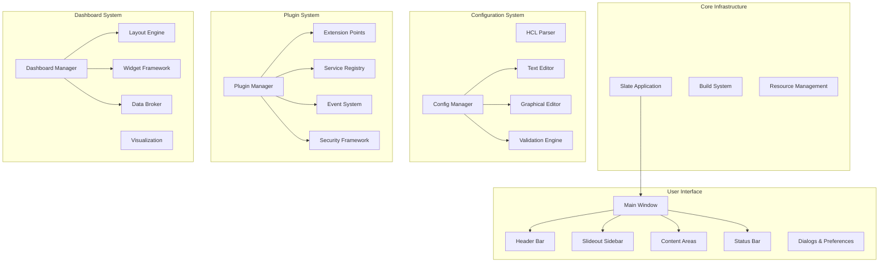
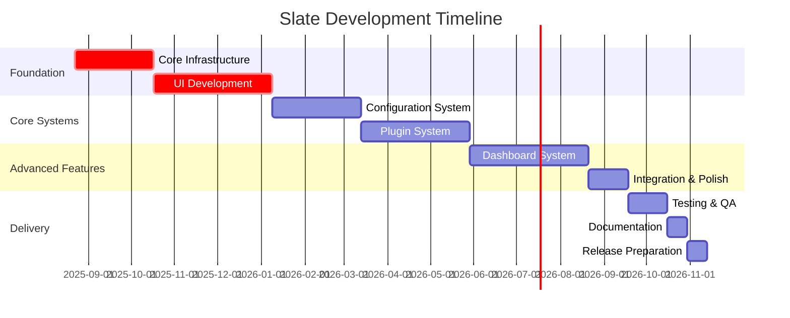

# Slate Development Planning

This document provides an overview of the comprehensive planning effort for Slate, an extensible desktop application framework built with GTK4 and Libadwaita. The planning is organized into specification documents that define what to build, and planning documents that detail how to build it.

## Project Overview

Slate is designed as the spiritual successor to Dactl, providing a modern, extensible platform for building measurement and control applications. Built on GTK4/Libadwaita with a robust plugin system, Slate aims to be simple to use, highly configurable, and well-tested across multiple platforms.

### Key Goals

- **Simplicity:** Easy to use for both end users and plugin developers
- **Extensibility:** Comprehensive plugin system exposing all functionality
- **Modern Architecture:** Built on GTK4/Libadwaita with current best practices
- **Cross-Platform:** Support for Linux, macOS, and Windows
- **Well-Tested:** Comprehensive testing at all levels
- **Excellent Documentation:** Complete documentation for users and developers

## Project Architecture

## Planning Documents Structure

### Specification Documents (`docs/spec/`)

Specification documents define the detailed requirements, architecture, and design for each major component of Slate. These documents serve as the authoritative reference for what needs to be built.

#### [Core Application Architecture](spec/2025-08-22-core-application-architecture.md)

Defines the overall application structure, technology stack, design patterns, and core architectural decisions. Covers the main application class, window management, navigation patterns, and foundational systems.

**Key Components:**

- SlateApplication (main app class)
- SlateMainWindow (primary window)
- Navigation architecture
- Component communication patterns
- Error handling and logging
- Performance requirements

#### [User Interface Components](spec/2025-08-22-user-interface-components.md)

Comprehensive specification for all user interface components, including layout, behavior, styling, and interaction patterns following GNOME Human Interface Guidelines.

**Key Components:**

- Header bar with title, actions, and navigation
- Slideout sidebar for contextual information
- Main content area with stack-based navigation
- Status bar for application status and progress
- Preferences dialog and standard dialogs
- Responsive design and accessibility features

#### [Configuration System](spec/2025-08-22-configuration-system.md)

Detailed specification for the HCL-based configuration system, including parsing, validation, editing interfaces, and project management functionality.

**Key Components:**

- HCL parser using libghcl
- Configuration validation and schema system
- Text editor with syntax highlighting
- Graphical node-based editor
- Project management and file operations
- Import/export and migration tools

#### [Plugin System](spec/2025-08-22-plugin-system.md)

Comprehensive plugin architecture built on libpeas, defining extension points, communication mechanisms, security framework, and development tools.

**Key Components:**

- Plugin manager and lifecycle management
- Extension points for UI, configuration, and data
- Service registry and event system
- Security framework with permissions and sandboxing
- Development tools and testing framework
- Plugin distribution and management

#### [Dashboard System](spec/2025-08-22-dashboard-system.md)

Specification for the flexible dashboard system providing configurable interfaces for data visualization and system control through a widget-based architecture.

**Key Components:**

- Dashboard manager and layout system
- Widget framework with display, control, and chart widgets
- Data broker for real-time data management
- Configuration integration for dashboard setup
- Plugin integration for custom widgets
- Performance optimization for real-time updates

### Planning Documents (`docs/plan/`)

Planning documents break down the specifications into actionable work packages, tasks, and timelines. These documents provide the roadmap for implementation.

#### [Core Infrastructure](plan/2025-08-22-core-infrastructure.md)

**Timeline:** 6-8 weeks
**Priority:** Critical
**Dependencies:** None

Breaks down the implementation of core application infrastructure including build system, application framework, window management, and basic navigation.

**Major Work Packages:**

- Project foundation setup (build system, CI/CD)
- Core application structure (SlateApplication, main entry point)
- Window management system (main window, header bar)
- Navigation infrastructure (view stack, navigation controller)
- Settings and configuration infrastructure

#### [User Interface Development](plan/2025-08-22-user-interface-development.md)

**Timeline:** 10-12 weeks
**Priority:** Critical
**Dependencies:** Core Infrastructure

Comprehensive UI component implementation including all interface elements, responsive design, and accessibility features.

**Major Work Packages:**

- Core UI components (header bar, sidebar, status bar)
- Content area development (framework, view management, responsive layout)
- Dialogs and windows (preferences, standard dialogs)
- Theming and polish (theme management, accessibility, testing)

#### [Configuration Implementation](plan/2025-08-22-configuration-implementation.md)

**Timeline:** 8-9 weeks
**Priority:** High
**Dependencies:** Core Infrastructure, UI Development

Implementation of the complete configuration system from HCL parsing through editing interfaces.

**Major Work Packages:**

- HCL foundation (libghcl integration, parser, schema system)
- Configuration core system (manager, validation engine, project system)
- Configuration editors (text editor, graphical editor, synchronization)
- Import/export and migration (file operations, format conversion, migration tools)

#### [Plugin System Development](plan/2025-08-22-plugin-system-development.md)

**Timeline:** 10-11 weeks
**Priority:** High
**Dependencies:** Core Infrastructure, UI Development, Configuration System

Complete plugin system implementation including extension points, security, and development tools.

**Major Work Packages:**

- Plugin foundation (libpeas integration, plugin manager, extension framework)
- Extension point implementation (UI, configuration, data extensions)
- Plugin communication system (service registry, event system, plugin API)
- Security and development tools (security framework, dev tools, testing framework)
- Plugin distribution and management (packaging, manager UI, documentation)

#### [Dashboard Implementation](plan/2025-08-22-dashboard-implementation.md)

**Timeline:** 10-12 weeks
**Priority:** High
**Dependencies:** All previous systems

Implementation of the dashboard system including widgets, layouts, and data management.

**Major Work Packages:**

- Dashboard foundation (framework, layout system, widget base classes)
- Widget implementation (display, control, chart widgets)
- Data management system (data broker, sources, processing)
- Integration and configuration (config integration, plugin integration, editor integration)
- Performance and polish (optimization, UI polish, testing)

#### [Issue Generation](plan/2025-08-22-issue-generation.md)

**Timeline:** 2-3 weeks
**Priority:** Medium
**Dependencies:** All planning documents

Process for converting planning documents into actionable GitHub issues with proper organization, labeling, and tracking.

**Major Work Packages:**

- Issue creation process (epics, features, tasks)
- Issue organization and tracking (labeling, milestones, dependencies)
- Quality assurance and automation (templates, validation, progress tracking)

## Development Timeline

### Overall Project Timeline

### Development Phases

#### Phase 1: Foundation (Months 1-2)

**Focus:** Core Infrastructure and Basic UI
**Deliverables:**

- Functional application with basic window management
- Core UI components operational
- Settings system working
- Build and development environment complete

#### Phase 2: Core Systems (Months 3-4)

**Focus:** Configuration and Plugin Systems
**Deliverables:**

- HCL configuration system functional
- Plugin system operational with extension points
- Configuration editors working
- Plugin development tools available

#### Phase 3: Advanced Features (Months 5-6)

**Focus:** Dashboard System and Integration
**Deliverables:**

- Dashboard system with core widgets
- Data management and visualization
- Complete system integration
- Performance optimization

#### Phase 4: Release Preparation (Month 7)

**Focus:** Testing, Documentation, and Polish
**Deliverables:**

- Comprehensive testing complete
- Documentation finished
- Release package prepared
- Community feedback incorporated

## Resource Requirements

### Development Team Structure

#### Core Team (Minimum Viable)

- **1 Senior Developer/Architect:** Overall architecture and critical components
- **1 UI/UX Developer:** Interface design and implementation
- **1 Systems Developer:** Plugin system and configuration management
- **1 QA Engineer:** Testing and quality assurance

#### Extended Team (Optimal)

- **1 Additional Senior Developer:** Parallel development streams
- **1 Documentation Specialist:** Comprehensive documentation
- **1 DevOps Engineer:** CI/CD and build system optimization
- **1 Community Manager:** Developer relations and feedback

### Technical Resources

#### Development Environment

- **Linux Development Machines:** Primary development platform
- **macOS/Windows Test Machines:** Cross-platform validation
- **CI/CD Infrastructure:** Automated building and testing
- **Documentation Platform:** API docs and user guides

#### External Dependencies

- **GTK4/Libadwaita:** UI framework (≥ 4.10/1.4)
- **libpeas:** Plugin system foundation (≥ 1.30)
- **GLib/GObject:** Core libraries (≥ 2.76)
- **Additional Libraries:** See individual specification documents

## Quality Assurance Strategy

### Testing Framework

#### Automated Testing

- **Unit Tests:** All core components and business logic
- **Integration Tests:** Component interaction and workflows
- **Performance Tests:** Memory usage, startup time, responsiveness
- **Accessibility Tests:** Screen reader and keyboard navigation
- **Visual Regression Tests:** UI consistency across themes and sizes

#### Manual Testing

- **Usability Testing:** User workflows and experience
- **Cross-Platform Testing:** Linux, macOS, Windows compatibility
- **Plugin Ecosystem Testing:** Third-party plugin integration
- **Stress Testing:** Large configurations and heavy usage

### Quality Metrics

#### Code Quality

- **Test Coverage:** ≥85% for core components
- **Code Review:** 100% of changes reviewed
- **Static Analysis:** No critical issues in production code
- **Memory Safety:** No leaks detected in valgrind

#### Performance Standards

- **Startup Time:** <2 seconds on modern hardware
- **Memory Usage:** <50MB baseline, <200MB with typical usage
- **Responsiveness:** UI remains responsive during operations
- **Plugin Loading:** <200ms per plugin

#### User Experience Standards

- **Accessibility:** WCAG 2.1 AA compliance
- **Internationalization:** All UI text translatable
- **Documentation:** Complete API and user documentation
- **Error Handling:** Clear, actionable error messages

## Risk Management

### Technical Risks

#### High-Impact Risks

1. **GTK4/Libadwaita Compatibility Issues**

   - Mitigation: Early testing with minimum supported versions
   - Contingency: Compatibility layers for older versions

2. **Plugin System Performance**

   - Mitigation: Performance testing throughout development
   - Contingency: Plugin loading optimization and lazy initialization

3. **Configuration System Complexity**
   - Mitigation: Incremental development with user feedback
   - Contingency: Simplified configuration format fallback

#### Medium-Impact Risks

1. **Cross-Platform Support Challenges**

   - Mitigation: Regular testing on all target platforms
   - Contingency: Platform-specific code paths where necessary

2. **Third-Party Plugin Ecosystem Development**
   - Mitigation: Excellent documentation and example plugins
   - Contingency: Extended core plugin set

### Project Risks

#### Schedule Risks

1. **Scope Creep**

   - Mitigation: Strict change control and feature freeze periods
   - Response: Feature deferral to future releases

2. **Dependency Delays**
   - Mitigation: Parallel development streams where possible
   - Response: Task reordering and resource reallocation

#### Resource Risks

1. **Team Availability**

   - Mitigation: Cross-training and documentation
   - Response: Temporary resource augmentation

2. **Technical Expertise Gaps**
   - Mitigation: Early skill assessment and training
   - Response: External consultation or contractor support

## Success Criteria

### Functional Success Criteria

- [ ] Application starts and runs on all target platforms
- [ ] All major subsystems (UI, config, plugins, dashboard) functional
- [ ] Plugin system supports third-party development
- [ ] Configuration system handles complex scenarios
- [ ] Dashboard system supports real-time data visualization

### Quality Success Criteria

- [ ] All automated tests pass consistently
- [ ] Performance requirements met on target hardware
- [ ] Accessibility compliance achieved
- [ ] Documentation complete and accurate
- [ ] User experience testing demonstrates usability

### Ecosystem Success Criteria

- [ ] Plugin development is straightforward for developers
- [ ] Configuration creation is intuitive for users
- [ ] System can handle real-world usage scenarios
- [ ] Foundation established for community growth
- [ ] Migration path from Dactl is viable

## Next Steps

### Immediate Actions (Week 1)

1. **Repository Setup**

   - Initialize project repository with proper structure
   - Set up build system and CI/CD pipeline
   - Create issue templates and project boards

2. **Team Onboarding**

   - Review planning documents with development team
   - Assign initial responsibilities and work streams
   - Set up development environment and tools

3. **Issue Generation**
   - Convert planning documents to GitHub issues
   - Establish issue hierarchy and dependencies
   - Set up milestone tracking and progress monitoring

### Short-Term Goals (Month 1)

1. **Foundation Development**

   - Complete core infrastructure implementation
   - Establish basic application framework
   - Implement essential UI components

2. **Process Establishment**
   - Finalize development workflows
   - Establish code review and testing procedures
   - Set up documentation and communication channels

### Medium-Term Goals (Months 2-3)

1. **System Integration**

   - Complete configuration system implementation
   - Begin plugin system development
   - Establish integration testing framework

2. **Community Preparation**
   - Prepare developer documentation
   - Create example projects and tutorials
   - Establish feedback and contribution processes

## Conclusion

This comprehensive planning effort provides a detailed roadmap for building Slate from concept to completion. The combination of thorough specifications and detailed work breakdowns ensures that the development team has clear guidance for creating a robust, extensible application framework.

The planning documents will be regularly updated as development progresses and requirements evolve. The modular structure allows for independent development of major components while maintaining clear integration points and dependencies.

Success depends on maintaining focus on the core goals of simplicity, extensibility, and quality while building a foundation for long-term growth of the Slate ecosystem.

---

**Document Status:** Complete
**Last Updated:** 2025-08-22
**Next Review:** Upon development phase completion
**Maintained By:** Slate Development Team
