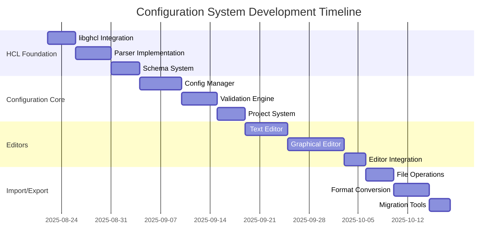
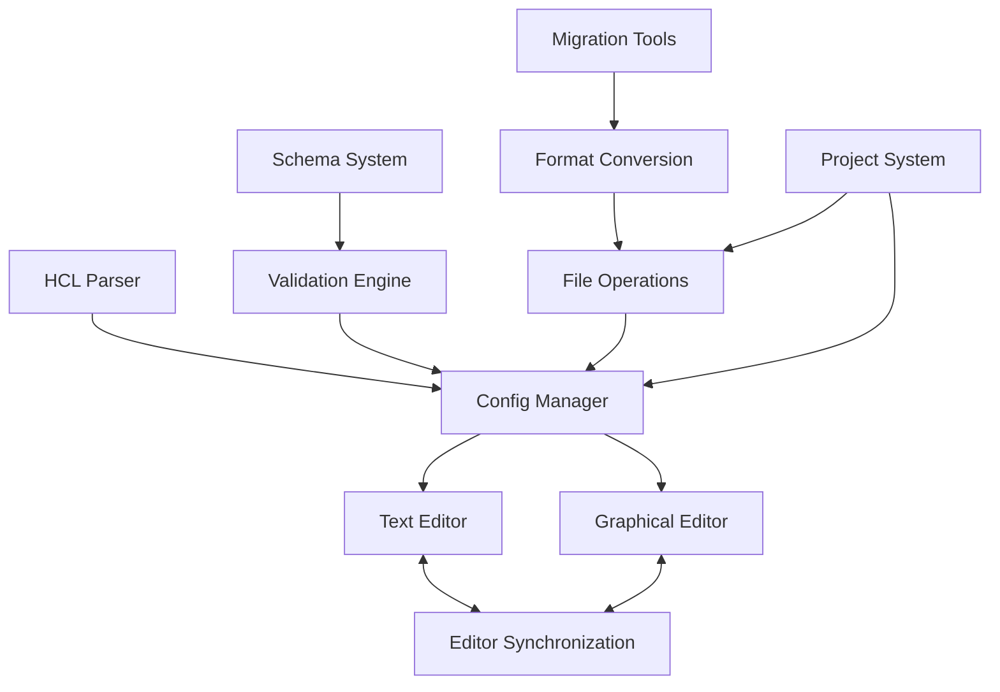

# Configuration System Implementation Work Breakdown

**Document:** 2025-08-22-configuration-implementation.md
**Version:** 1.0
**Status:** Draft

## Overview

This planning document details the implementation work required for Slate's configuration system, including HCL parsing, validation, editing interfaces, and project management functionality.

## Project Phases

## Work Packages

### WP1: HCL Foundation

#### WP1.1: libghcl Integration and Enhancement

**Estimated Effort:** 4 days
**Priority:** Critical
**Dependencies:** Core Infrastructure

**Tasks:**

1. **Enhance libghcl parser**

   - Review and improve existing HCL lexer implementation
   - Enhance parser to support full HCL syntax
   - Add support for advanced HCL features (functions, expressions)
   - Implement comprehensive error reporting

2. **Create AST manipulation tools**

   - Implement AST traversal utilities
   - Create AST modification capabilities
   - Add AST serialization back to HCL
   - Implement AST validation utilities

3. **Add memory management**

   - Implement proper reference counting
   - Add garbage collection for unused nodes
   - Create memory pool for efficient allocation
   - Add memory leak detection tools

4. **Create test suite for libghcl**
   - Implement comprehensive parser tests
   - Add AST manipulation tests
   - Create memory management tests
   - Set up performance benchmarks

**Deliverables:**

- Enhanced libghcl with full HCL support
- AST manipulation and serialization tools
- Comprehensive test suite
- Performance benchmarks

**Testing Requirements:**

- [ ] Parse all valid HCL syntax correctly
- [ ] Handle malformed HCL gracefully
- [ ] AST round-trip maintains semantics
- [ ] No memory leaks in normal operation
- [ ] Performance meets requirements

#### WP1.2: Configuration Parser Implementation

**Estimated Effort:** 5 days
**Priority:** Critical
**Dependencies:** WP1.1

**Tasks:**

1. **Create SlateConfigParser**

   - Implement high-level configuration parser
   - Add support for Slate-specific configuration sections
   - Create configuration object model
   - Implement parser error collection and reporting

2. **Implement configuration sections**

   - Create metadata section parser
   - Implement application configuration parser
   - Add plugin configuration section support
   - Create dashboard configuration parser

3. **Add validation integration**

   - Integrate with schema validation system
   - Implement semantic validation
   - Add cross-reference validation
   - Create validation error reporting

4. **Create parsing utilities**
   - Implement configuration merging utilities
   - Add configuration comparison tools
   - Create configuration diff utilities
   - Implement configuration templating

**Deliverables:**

- Complete configuration parser
- Configuration object model
- Validation integration
- Parsing and manipulation utilities

**Testing Requirements:**

- [ ] Parse valid Slate configurations correctly
- [ ] Report parser errors with line/column info
- [ ] Validation integrates properly
- [ ] Configuration manipulation works correctly
- [ ] Template system functions properly

#### WP1.3: Schema System Implementation

**Estimated Effort:** 4 days
**Priority:** Critical
**Dependencies:** WP1.2

**Tasks:**

1. **Create schema definition system**

   - Implement JSON Schema-based validation
   - Create Slate-specific schema extensions
   - Add support for plugin schema registration
   - Implement schema composition and inheritance

2. **Implement schema validation engine**

   - Create comprehensive validation engine
   - Add support for custom validators
   - Implement validation error collection
   - Create validation suggestion system

3. **Add schema management**

   - Implement schema loading and caching
   - Create schema version management
   - Add schema migration support
   - Implement schema documentation generation

4. **Create validation API**
   - Implement public validation API
   - Add real-time validation support
   - Create validation event system
   - Implement validation customization

**Deliverables:**

- Schema definition and validation system
- Plugin schema registration
- Validation API and utilities
- Schema management tools

**Testing Requirements:**

- [ ] Schema validation catches all error types
- [ ] Plugin schemas integrate properly
- [ ] Validation suggestions are helpful
- [ ] Schema migrations work correctly
- [ ] Real-time validation performs well

### WP2: Configuration Core System

#### WP2.1: Configuration Manager Implementation

**Estimated Effort:** 6 days
**Priority:** Critical
**Dependencies:** WP1.3

**Tasks:**

1. **Create SlateConfigManager**

   - Implement central configuration management
   - Add configuration loading and saving
   - Create configuration change notification system
   - Implement configuration backup and recovery

2. **Add configuration sections**

   - Create application configuration management
   - Implement plugin configuration isolation
   - Add user preference integration
   - Create runtime configuration support

3. **Implement configuration API**

   - Create public configuration access API
   - Add configuration modification API
   - Implement configuration monitoring
   - Create configuration event system

4. **Add configuration persistence**
   - Implement file-based configuration storage
   - Create configuration versioning
   - Add configuration synchronization
   - Implement configuration locking

**Deliverables:**

- Central configuration manager
- Configuration access and modification APIs
- Configuration persistence system
- Change notification and events

**Testing Requirements:**

- [ ] Configuration loads and saves correctly
- [ ] Change notifications work properly
- [ ] Plugin configuration isolation maintained
- [ ] Configuration persistence is reliable
- [ ] API provides proper error handling

#### WP2.2: Validation Engine Implementation

**Estimated Effort:** 5 days
**Priority:** High
**Dependencies:** WP2.1

**Tasks:**

1. **Create validation engine**

   - Implement comprehensive validation system
   - Add syntax, semantic, and runtime validation
   - Create validation rule engine
   - Implement validation caching

2. **Add validation types**

   - Implement schema-based validation
   - Create dependency validation
   - Add resource availability validation
   - Implement performance constraint validation

3. **Create validation reporting**

   - Implement detailed error reporting
   - Add validation warnings and suggestions
   - Create validation progress tracking
   - Implement validation result caching

4. **Add validation customization**
   - Create custom validation rule API
   - Implement plugin validation extensions
   - Add validation rule composition
   - Create validation configuration

**Deliverables:**

- Comprehensive validation engine
- Multiple validation types
- Detailed validation reporting
- Validation customization framework

**Testing Requirements:**

- [ ] All validation types work correctly
- [ ] Validation errors are informative
- [ ] Custom validation rules integrate properly
- [ ] Validation performance is acceptable
- [ ] Validation caching works correctly

#### WP2.3: Project System Implementation

**Estimated Effort:** 4 days
**Priority:** High
**Dependencies:** WP2.2

**Tasks:**

1. **Create project management**

   - Implement project structure definition
   - Add project creation and loading
   - Create project metadata management
   - Implement project validation

2. **Add project operations**

   - Create project saving and backup
   - Implement project export and import
   - Add project template support
   - Create project migration tools

3. **Implement project organization**

   - Add project file organization
   - Create asset management
   - Implement dependency tracking
   - Add project search and indexing

4. **Create project API**
   - Implement project management API
   - Add project event system
   - Create project plugin integration
   - Implement project sharing utilities

**Deliverables:**

- Complete project management system
- Project templates and migration tools
- Project organization and search
- Project management API

**Testing Requirements:**

- [ ] Projects create and load correctly
- [ ] Project operations work reliably
- [ ] Project templates function properly
- [ ] Project search finds relevant content
- [ ] Project API is complete and stable

### WP3: Configuration Editors

#### WP3.1: Text Editor Implementation

**Estimated Effort:** 6 days
**Priority:** High
**Dependencies:** WP2.3

**Tasks:**

1. **Create HCL text editor**

   - Implement GtkSourceView integration
   - Add HCL syntax highlighting
   - Create HCL auto-completion
   - Implement code folding and indentation

2. **Add validation integration**

   - Implement real-time syntax validation
   - Add inline error and warning indicators
   - Create validation tooltip display
   - Implement validation quick fixes

3. **Create editing features**

   - Add find and replace functionality
   - Implement code formatting
   - Create snippet support
   - Add bracket matching and selection

4. **Implement editor extensions**
   - Create plugin API for editor extensions
   - Add custom highlighting rules
   - Implement custom completion providers
   - Create editor action system

**Deliverables:**

- Feature-rich HCL text editor
- Real-time validation integration
- Advanced editing features
- Editor extension system

**Testing Requirements:**

- [ ] Syntax highlighting works correctly
- [ ] Auto-completion suggests appropriate items
- [ ] Real-time validation shows errors accurately
- [ ] All editing features function properly
- [ ] Editor extensions integrate seamlessly

#### WP3.2: Graphical Editor Implementation

**Estimated Effort:** 8 days
**Priority:** High
**Dependencies:** WP3.1

**Tasks:**

1. **Create graphical editor framework**

   - Implement canvas-based editor
   - Add node and connection system
   - Create drag-and-drop functionality
   - Implement zoom and pan controls

2. **Implement configuration nodes**

   - Create nodes for configuration sections
   - Add property editing panels
   - Implement node connection system
   - Create node validation display

3. **Add editing operations**

   - Implement node creation and deletion
   - Add connection creation and removal
   - Create copy, paste, and duplicate operations
   - Implement undo/redo functionality

4. **Create visual features**
   - Add grid and snap-to-grid
   - Implement selection and multi-selection
   - Create visual feedback for operations
   - Add layout and alignment tools

**Deliverables:**

- Complete graphical configuration editor
- Node-based configuration editing
- Full editing operation support
- Professional visual interface

**Testing Requirements:**

- [ ] Graphical editor renders correctly
- [ ] Node operations work smoothly
- [ ] Configuration mapping is accurate
- [ ] Undo/redo functionality works properly
- [ ] Visual features enhance usability

#### WP3.3: Editor Integration and Synchronization

**Estimated Effort:** 3 days
**Priority:** High
**Dependencies:** WP3.2

**Tasks:**

1. **Create editor synchronization**

   - Implement bidirectional synchronization
   - Add change conflict resolution
   - Create synchronization status display
   - Implement synchronization preferences

2. **Add view switching**

   - Create seamless editor switching
   - Implement view state preservation
   - Add view preference management
   - Create view-specific toolbars

3. **Implement collaborative features**

   - Add change tracking and attribution
   - Create comment and annotation system
   - Implement collaborative editing markers
   - Add conflict resolution interface

4. **Create editor preferences**
   - Implement editor-specific settings
   - Add view layout customization
   - Create editor theme support
   - Implement accessibility preferences

**Deliverables:**

- Synchronized dual-editor system
- Seamless view switching
- Collaborative editing features
- Comprehensive editor preferences

**Testing Requirements:**

- [ ] Editors stay synchronized correctly
- [ ] View switching preserves state
- [ ] Collaborative features work properly
- [ ] Editor preferences apply correctly
- [ ] Conflict resolution is intuitive

### WP4: Import/Export and Migration

#### WP4.1: File Operations Implementation

**Estimated Effort:** 4 days
**Priority:** Medium
**Dependencies:** WP3.3

**Tasks:**

1. **Create file I/O system**

   - Implement robust file loading and saving
   - Add file format detection
   - Create file backup and recovery
   - Implement file locking and concurrency

2. **Add batch operations**

   - Create batch file processing
   - Implement directory operations
   - Add recursive file handling
   - Create operation progress tracking

3. **Implement file validation**

   - Add file integrity checking
   - Create file format validation
   - Implement security scanning
   - Add file metadata extraction

4. **Create file management**
   - Implement recent files tracking
   - Add file organization utilities
   - Create file search and filtering
   - Implement file tagging system

**Deliverables:**

- Robust file I/O system
- Batch file operations
- File validation and security
- File management utilities

**Testing Requirements:**

- [ ] File operations handle errors gracefully
- [ ] Batch operations process correctly
- [ ] File validation catches issues
- [ ] File management features work properly
- [ ] Concurrent access is handled safely

#### WP4.2: Format Conversion System

**Estimated Effort:** 5 days
**Priority:** Medium
**Dependencies:** WP4.1

**Tasks:**

1. **Create conversion framework**

   - Implement pluggable conversion system
   - Add format registry and detection
   - Create conversion pipeline
   - Implement conversion validation

2. **Add format converters**

   - Create JSON to HCL converter
   - Implement XML to HCL converter
   - Add YAML to HCL converter
   - Create CSV to HCL converter

3. **Implement conversion validation**

   - Add conversion accuracy checking
   - Create conversion quality metrics
   - Implement conversion warnings
   - Add conversion rollback

4. **Create conversion UI**
   - Implement conversion wizard
   - Add conversion preview
   - Create conversion batch processing
   - Implement conversion history

**Deliverables:**

- Flexible format conversion system
- Multiple format converters
- Conversion validation and quality checking
- User-friendly conversion interface

**Testing Requirements:**

- [ ] Format converters work accurately
- [ ] Conversion validation is thorough
- [ ] Conversion UI is intuitive
- [ ] Batch conversion processes correctly
- [ ] Conversion history is maintained

#### WP4.3: Migration Tools Implementation

**Estimated Effort:** 3 days
**Priority:** Medium
**Dependencies:** WP4.2

**Tasks:**

1. **Create Dactl migration**

   - Implement Dactl XML parser
   - Create Dactl to Slate configuration mapping
   - Add migration validation and testing
   - Create migration report generation

2. **Add version migration**

   - Implement configuration version detection
   - Create migration path framework
   - Add incremental migration support
   - Implement migration rollback

3. **Create migration tools**

   - Implement migration wizard
   - Add migration preview and comparison
   - Create migration batch processing
   - Implement migration documentation

4. **Add migration validation**
   - Create migration accuracy checking
   - Implement functionality verification
   - Add migration testing framework
   - Create migration quality reports

**Deliverables:**

- Complete Dactl migration system
- Version migration framework
- Migration tools and wizards
- Migration validation and testing

**Testing Requirements:**

- [ ] Dactl migration preserves functionality
- [ ] Version migrations work correctly
- [ ] Migration tools are user-friendly
- [ ] Migration validation is thorough
- [ ] Migration quality is high

## Integration Points and Dependencies

### Component Integration Flow

### External Dependencies

- **libghcl:** Core HCL parsing (internal subproject)
- **GtkSourceView:** Text editor with syntax highlighting
- **JSON-GLib:** JSON schema validation
- **libxml2:** XML parsing for migration tools

### Plugin Integration Points

- **Schema Registration:** Plugins can register configuration schemas
- **Validation Extensions:** Custom validation rules
- **Editor Extensions:** Syntax highlighting, completion providers
- **Conversion Plugins:** Custom format converters

## Quality Standards

### Performance Requirements

- **Configuration Loading:** < 500ms for typical configurations
- **Real-time Validation:** < 100ms response time
- **Editor Responsiveness:** < 50ms for typing response
- **Large File Handling:** Support files up to 10MB

### Reliability Requirements

- **Data Integrity:** No data loss during any operation
- **Error Recovery:** Graceful handling of all error conditions
- **Validation Accuracy:** 99.9% accuracy in error detection
- **Migration Quality:** 100% functional preservation for Dactl migration

## Risk Management

### Technical Risks

1. **HCL Parser Complexity**

   - Risk: Complex HCL syntax edge cases
   - Mitigation: Comprehensive test suite with real-world examples
   - Contingency: Simplified HCL subset for initial release

2. **Real-time Validation Performance**

   - Risk: Validation too slow for real-time editing
   - Mitigation: Validation caching and incremental validation
   - Contingency: Optional real-time validation with manual trigger

3. **Editor Synchronization Complexity**
   - Risk: Synchronization bugs between text and graphical editors
   - Mitigation: Thorough testing and clear synchronization protocols
   - Contingency: Single editor mode fallback

### Project Risks

1. **Configuration Format Evolution**

   - Risk: HCL format changes breaking compatibility
   - Mitigation: Version detection and migration framework
   - Contingency: Multiple format support

2. **Migration Accuracy**
   - Risk: Dactl migration loses functionality
   - Mitigation: Comprehensive testing with real Dactl configurations
   - Contingency: Manual migration assistance tools

## Testing Strategy

### Unit Testing

- **Parser Testing:** All HCL syntax variations
- **Validation Testing:** All validation rules and edge cases
- **Editor Testing:** All editing operations and features
- **Migration Testing:** All supported source formats

### Integration Testing

- **End-to-end Workflows:** Complete configuration creation and editing
- **Cross-Editor Testing:** Synchronization between editors
- **Plugin Integration:** Configuration system with plugins
- **Performance Testing:** Large configurations and rapid editing

### User Experience Testing

- **Usability Testing:** Editor interfaces and workflows
- **Accessibility Testing:** Screen reader and keyboard navigation
- **Error Handling Testing:** User experience with errors
- **Migration Testing:** User experience with migration tools

## Success Criteria

### Functional Success Criteria

- [ ] Parse and validate all supported HCL syntax
- [ ] Text and graphical editors fully functional
- [ ] Real-time validation working properly
- [ ] Project management system complete
- [ ] Migration tools preserve functionality

### Quality Success Criteria

- [ ] Performance requirements met
- [ ] No data loss in any scenario
- [ ] Validation accuracy meets requirements
- [ ] User experience testing positive
- [ ] All automated tests passing

### User Experience Success Criteria

- [ ] Configuration editing is intuitive
- [ ] Error messages are helpful
- [ ] Migration process is smooth
- [ ] Performance feels responsive
- [ ] Documentation is comprehensive

## Resource Requirements

### Development Team

- **1 Senior Developer:** Configuration system architecture
- **1 Parser Developer:** HCL parsing and validation
- **1 UI Developer:** Editor implementation
- **1 Migration Specialist:** Migration tools and testing

### External Resources

- **HCL Documentation:** Official HCL specification
- **Dactl Configurations:** Real-world Dactl configurations for testing
- **User Feedback:** Configuration editing workflows and preferences

## Timeline and Milestones

### Milestone 1: HCL Foundation (Week 1-2)

- libghcl enhanced and tested
- Configuration parser working
- Schema system functional

### Milestone 2: Core System (Week 3-4)

- Configuration manager complete
- Validation engine working
- Project system functional

### Milestone 3: Editors (Week 5-7)

- Text editor with validation
- Graphical editor functional
- Editor synchronization working

### Milestone 4: Import/Export (Week 8-9)

- File operations complete
- Format conversion working
- Migration tools functional

## Handoff Criteria

### Technical Handoff

- [ ] All configuration components implemented
- [ ] Comprehensive test suite passing
- [ ] Documentation complete and accurate
- [ ] Performance requirements validated
- [ ] Integration tests with other systems passing

### User Experience Handoff

- [ ] Editor interfaces polished and tested
- [ ] Migration workflows validated
- [ ] Error handling user-friendly
- [ ] Documentation accessible to end users
- [ ] User feedback incorporated

### Next Phase Readiness

- [ ] Plugin configuration APIs available
- [ ] Dashboard configuration support ready
- [ ] Extension points documented
- [ ] Configuration examples provided
- [ ] Developer tools and documentation complete
