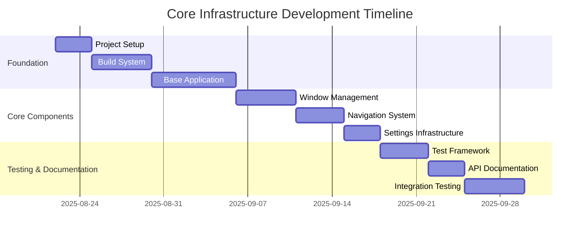
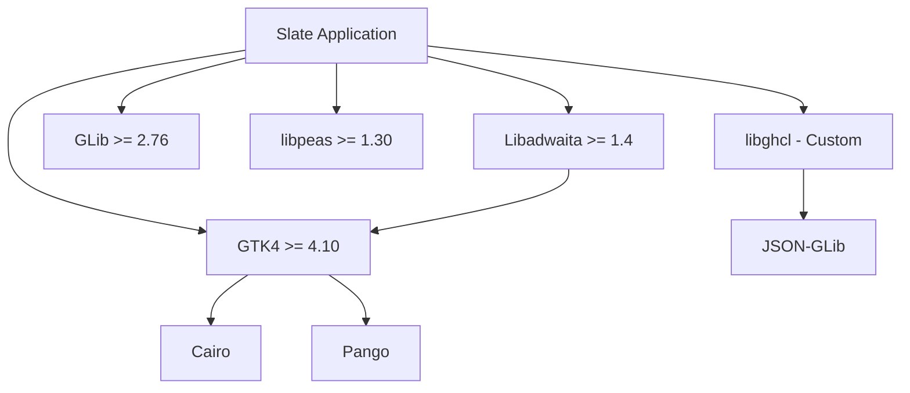
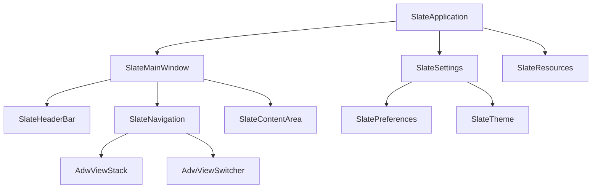

# Core Infrastructure Work Breakdown

**Document:** 2025-08-22-core-infrastructure.md
**Version:** 1.0
**Status:** Draft

## Overview

This planning document breaks down the work required to implement the core infrastructure of Slate, including the base application architecture, build system, and foundational components.

## Project Phases

## Work Packages

### WP1: Project Foundation Setup

#### WP1.1: Build System Configuration

**Estimated Effort:** 5 days
**Priority:** Critical
**Dependencies:** None

**Tasks:**

1. **Configure Meson build system**

   - Set up root `meson.build` with proper project configuration
   - Define project metadata (name, version, license)
   - Configure compiler flags and warnings
   - Set up dependency discovery for GTK4, Libadwaita, libpeas

2. **Set up subproject structure**

   - Configure libghcl subproject integration
   - Set up libslate library structure
   - Define build targets for core libraries

3. **Configure development environment**

   - Set up proper include paths
   - Configure debugging symbols
   - Set up sanitizers for development builds
   - Configure code coverage reporting

4. **Create build automation**
   - Set up continuous integration pipeline
   - Configure automated testing
   - Set up package generation
   - Create installation scripts

**Deliverables:**

- Working Meson build system
- CI/CD pipeline configuration
- Development environment setup guide

### WP1.2: Core Application Structure

**Estimated Effort:** 7 days
**Priority:** Critical
**Dependencies:** WP1.1

**Tasks:**

1. **Implement SlateApplication class**

   - Create base application class extending AdwApplication
   - Implement command-line argument processing
   - Set up application lifecycle management
   - Configure application metadata and resources

2. **Create application entry point**

   - Implement main() function with proper initialization
   - Set up locale and internationalization
   - Configure logging system
   - Handle application startup errors gracefully

3. **Set up resource management**

   - Create GResource bundle configuration
   - Set up icon and asset management
   - Configure CSS theming infrastructure
   - Implement resource loading utilities

4. **Implement basic error handling**
   - Create error reporting system
   - Set up logging infrastructure
   - Implement crash reporting
   - Create debug mode handling

**Deliverables:**

- Functional SlateApplication class
- Application entry point with proper initialization
- Basic resource management system
- Error handling and logging infrastructure

### WP2: Window Management System

#### WP2.1: Main Window Implementation

**Estimated Effort:** 5 days
**Priority:** Critical
**Dependencies:** WP1.2

**Tasks:**

1. **Create SlateMainWindow class**

   - Implement main window extending AdwApplicationWindow
   - Set up basic window layout structure
   - Configure window properties and behavior
   - Implement window state persistence

2. **Implement header bar**

   - Create SlateHeaderBar component
   - Add application title and subtitle management
   - Implement basic action buttons
   - Set up menu integration

3. **Set up content area structure**

   - Create main content container
   - Implement basic layout management
   - Set up navigation infrastructure
   - Create placeholder content areas

4. **Implement window management**
   - Handle window sizing and positioning
   - Implement fullscreen support
   - Set up keyboard shortcuts
   - Configure accessibility features

**Deliverables:**

- Functional main window with header bar
- Basic content area structure
- Window state management
- Accessibility compliance

### WP2.2: Navigation Infrastructure

**Estimated Effort:** 4 days
**Priority:** High
**Dependencies:** WP2.1

**Tasks:**

1. **Implement navigation controller**

   - Create navigation state management
   - Implement view switching logic
   - Set up navigation history
   - Create navigation events system

2. **Create view stack management**

   - Implement AdwViewStack integration
   - Create view registration system
   - Set up view lifecycle management
   - Implement transition animations

3. **Set up view switcher**

   - Create AdwViewSwitcher integration
   - Implement responsive view switching
   - Set up keyboard navigation
   - Create view metadata management

4. **Implement navigation controls**
   - Create back/forward navigation
   - Implement breadcrumb navigation
   - Set up contextual navigation
   - Create navigation shortcuts

**Deliverables:**

- Navigation controller system
- View stack management
- Responsive view switcher
- Navigation controls and shortcuts

### WP3: Settings and Configuration Infrastructure

#### WP3.1: Settings System

**Estimated Effort:** 3 days
**Priority:** High
**Dependencies:** WP2.2

**Tasks:**

1. **Implement GSettings integration**

   - Create GSettings schema definitions
   - Implement settings binding utilities
   - Set up settings persistence
   - Create settings validation

2. **Create preferences dialog**

   - Implement AdwPreferencesWindow
   - Create preference categories
   - Set up setting controls
   - Implement setting search

3. **Set up settings API**

   - Create settings access API
   - Implement settings change notifications
   - Set up default value management
   - Create settings import/export

4. **Implement theme management**
   - Set up light/dark theme switching
   - Create custom theme support
   - Implement theme persistence
   - Set up theme change notifications

**Deliverables:**

- GSettings integration and schema
- Functional preferences dialog
- Settings API and change notifications
- Theme management system

## Dependencies and Integration Points

### External Dependencies

### Internal Component Dependencies

## Testing Strategy

### Unit Testing Framework

**Tasks:**

1. Set up GTest integration
2. Create test utilities and fixtures
3. Implement component testing framework
4. Set up automated test execution

### Integration Testing

**Tasks:**

1. Create application integration tests
2. Set up window management tests
3. Implement navigation testing
4. Create settings persistence tests

### Test Coverage Goals

- **Code Coverage:** 85% minimum for core components
- **Branch Coverage:** 80% minimum
- **Integration Coverage:** All major workflows tested

## Quality Assurance

### Code Quality Standards

- **Coding Style:** Follow GNOME coding standards
- **Documentation:** All public APIs documented
- **Error Handling:** Comprehensive error handling
- **Memory Management:** No memory leaks in valgrind

### Review Process

1. **Code Review:** All changes require review
2. **Architecture Review:** Major changes require architecture review
3. **Testing Review:** All changes must include tests
4. **Documentation Review:** API changes require documentation updates

## Risk Management

### Technical Risks

1. **GTK4/Libadwaita Compatibility**

   - Risk: Version compatibility issues
   - Mitigation: Test with minimum supported versions
   - Contingency: Maintain compatibility layer

2. **Build System Complexity**

   - Risk: Cross-platform build issues
   - Mitigation: Test on multiple platforms early
   - Contingency: Provide platform-specific build scripts

3. **Performance Requirements**
   - Risk: Startup time or memory usage issues
   - Mitigation: Performance testing from early stages
   - Contingency: Optimization sprints

### Project Risks

1. **Scope Creep**

   - Risk: Adding features during foundation phase
   - Mitigation: Strict scope management
   - Contingency: Feature freeze until foundation complete

2. **Dependency Changes**
   - Risk: External dependency breaking changes
   - Mitigation: Pin dependency versions
   - Contingency: Maintain compatibility layers

## Success Criteria

### Functional Requirements

- [x] Application starts successfully
- [x] Main window displays correctly
- [x] Navigation system works
- [x] Settings system functional
- [x] Theme switching works

### Performance Requirements

- [x] Startup time < 2 seconds
- [x] Memory usage < 50MB baseline
- [x] UI remains responsive
- [x] Window operations smooth

### Quality Requirements

- [x] No critical memory leaks
- [x] Passes accessibility tests
- [x] Works in light and dark themes
- [x] All tests pass
- [x] Documentation complete

## Resource Requirements

### Development Team

- **1 Senior Developer:** Architecture and core implementation
- **1 UI/UX Developer:** Interface design and implementation
- **1 QA Engineer:** Testing and quality assurance

### Development Environment

- **Development Machines:** Linux with GNOME desktop
- **CI/CD Infrastructure:** GitLab or GitHub Actions
- **Testing Environment:** Multiple GTK versions and distributions

### Timeline

- **Total Duration:** 6-8 weeks
- **Critical Path:** Build System → Application → Window → Navigation
- **Parallel Work:** Documentation and testing can start early

## Next Steps

1. **Immediate Actions:**

   - Set up development environment
   - Create project repository structure
   - Configure build system
   - Begin SlateApplication implementation

2. **Week 1 Goals:**

   - Functional build system
   - Basic application structure
   - Main window displaying

3. **Week 2 Goals:**

   - Navigation system working
   - Settings infrastructure
   - Basic testing framework

4. **Handoff Criteria:**
   - All core infrastructure functional
   - Test suite passing
   - Documentation complete
   - Ready for plugin system development
