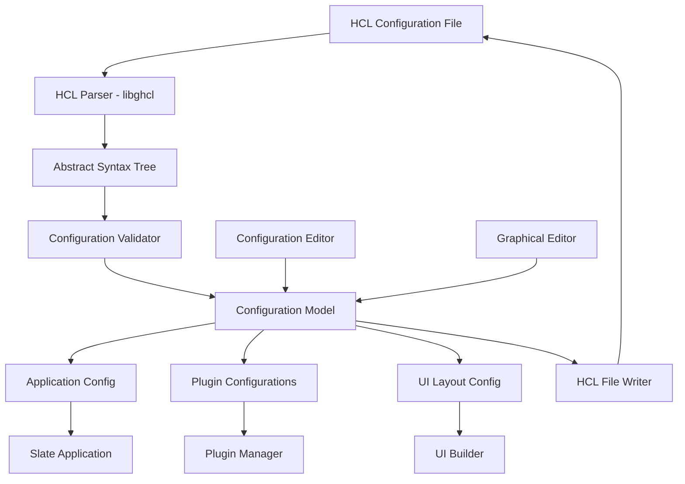
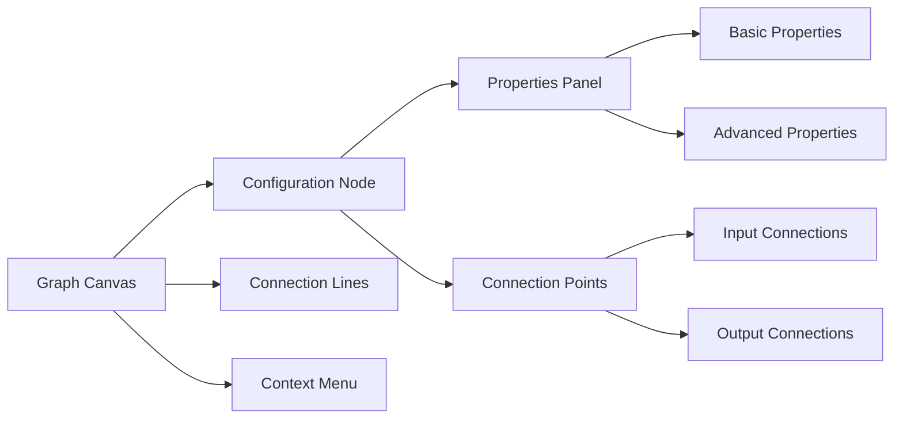
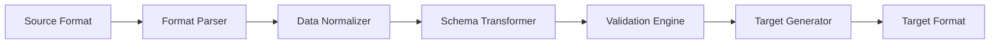

# Configuration System Specification

**Document:** 2025-08-22-configuration-system.md
**Version:** 1.0
**Status:** Draft

## Overview

This specification defines the configuration system for Slate, including HCL format support, configuration parsing, validation, editing interfaces, and the relationship between configuration and application behavior.

## Purpose

Provide a flexible, human-readable, and extensible configuration system that supports both textual and graphical editing while maintaining type safety and validation.

## Configuration Format

### HCL (HashiCorp Configuration Language)

#### Why HCL?

- Human-readable and writable
- Supports complex data structures
- Native support for comments
- JSON-compatible for programmatic generation
- Established ecosystem and tooling

#### Basic Structure

```hcl
# Slate Configuration File
# This file defines the application behavior and UI layout

metadata {
  name        = "Sample Project"
  version     = "1.0.0"
  description = "A sample Slate project configuration"
  author      = "User Name"
}

application {
  title = "My Slate Application"

  window {
    width  = 1024
    height = 768
    resizable = true
  }

  theme {
    mode = "auto" # "light", "dark", "auto"
  }
}

plugins {
  enabled = [
    "core.measurement",
    "core.control",
    "ui.dashboard"
  ]

  plugin "measurement" {
    provider = "core.measurement"

    config {
      sample_rate = 1000
      channels    = 8
    }
  }
}

dashboard {
  layout {
    type = "grid"
    columns = 3
    rows    = 2
  }

  widget "temperature_display" {
    type = "gauge"
    position {
      column = 1
      row    = 1
    }

    data_source = "sensors.temperature"

    properties {
      min_value = 0
      max_value = 100
      units     = "°C"
      title     = "Temperature"
    }
  }
}
```

## Configuration Architecture



## Core Components

### SlateConfigManager

#### Purpose

Central configuration management system that handles loading, parsing, validation, and persistence of configuration data.

#### Responsibilities

- Configuration file discovery and loading
- HCL parsing using libghcl
- Schema validation
- Change notification
- Configuration persistence
- Plugin configuration isolation

#### API Design

```c
// Configuration loading
SlateConfig* slate_config_load_from_file(const char* path, GError** error);
SlateConfig* slate_config_load_from_string(const char* content, GError** error);

// Configuration access
GVariant* slate_config_get_section(SlateConfig* config, const char* section);
gboolean slate_config_set_section(SlateConfig* config, const char* section, GVariant* data);

// Validation
gboolean slate_config_validate(SlateConfig* config, GError** error);
GList* slate_config_get_warnings(SlateConfig* config);

// Persistence
gboolean slate_config_save_to_file(SlateConfig* config, const char* path, GError** error);
char* slate_config_to_string(SlateConfig* config);

// Change monitoring
void slate_config_connect_changed(SlateConfig* config, SlateConfigChangedFunc callback, gpointer user_data);
```

### Configuration Schema System

#### Purpose

Defines the structure, types, and validation rules for configuration data.

#### Schema Definition

```json
{
  "metadata": {
    "type": "object",
    "required": ["name", "version"],
    "properties": {
      "name": { "type": "string", "minLength": 1 },
      "version": { "type": "string", "pattern": "^\\d+\\.\\d+\\.\\d+$" },
      "description": { "type": "string" },
      "author": { "type": "string" }
    }
  },
  "application": {
    "type": "object",
    "properties": {
      "title": { "type": "string", "default": "Slate Application" },
      "window": {
        "type": "object",
        "properties": {
          "width": { "type": "integer", "minimum": 640, "default": 1024 },
          "height": { "type": "integer", "minimum": 480, "default": 768 },
          "resizable": { "type": "boolean", "default": true }
        }
      }
    }
  }
}
```

### Plugin Configuration System

#### Purpose

Provides isolated configuration management for plugins while maintaining schema validation.

#### Plugin Schema Registration

```c
// Plugin schema registration
gboolean slate_config_register_plugin_schema(
    const char* plugin_id,
    GVariant* schema,
    GError** error
);

// Plugin configuration access
GVariant* slate_config_get_plugin_config(
    SlateConfig* config,
    const char* plugin_id
);

gboolean slate_config_set_plugin_config(
    SlateConfig* config,
    const char* plugin_id,
    GVariant* plugin_config,
    GError** error
);
```

## Configuration Editor

### Text Editor Component

#### Purpose

Provides a sophisticated text editing experience for HCL configuration files.

#### Requirements

- Uses GtkSourceView for syntax highlighting
- HCL syntax highlighting and auto-completion
- Real-time validation with error indicators
- Code folding for large configurations
- Search and replace functionality

#### Features

- **Syntax Highlighting:** HCL-specific syntax coloring
- **Error Indicators:** Inline error and warning markers
- **Auto-completion:** Context-aware suggestions
- **Validation:** Real-time syntax and schema validation
- **Formatting:** Auto-indent and code formatting

### Graphical Editor Component

#### Purpose

Provides a visual, node-based interface for editing configuration structures.

#### Design Approach



#### Node Types

- **Configuration Blocks:** Represent HCL blocks (application, plugins, etc.)
- **Property Nodes:** Individual configuration properties
- **Plugin Nodes:** Plugin-specific configuration sections
- **Data Flow Nodes:** Connections between components

#### Interaction Model

- **Node Selection:** Click to select, shows properties in sidebar
- **Node Creation:** Drag from palette or context menu
- **Connection Creation:** Drag from output to input ports
- **Property Editing:** Inline editing or sidebar panels

## Configuration Validation

### Validation Levels

#### Syntax Validation

- HCL parsing correctness
- Proper block structure
- Valid attribute syntax

#### Schema Validation

- Type checking against defined schemas
- Required field validation
- Range and constraint validation

#### Semantic Validation

- Plugin dependency checking
- Resource reference validation
- Circular dependency detection

#### Runtime Validation

- Plugin availability checking
- Resource accessibility validation
- Performance constraint validation

### Error Reporting

#### Error Types

```c
typedef enum {
    SLATE_CONFIG_ERROR_SYNTAX,      // HCL syntax errors
    SLATE_CONFIG_ERROR_SCHEMA,      // Schema validation errors
    SLATE_CONFIG_ERROR_SEMANTIC,    // Logical errors
    SLATE_CONFIG_ERROR_RUNTIME      // Runtime validation errors
} SlateConfigErrorType;

typedef struct {
    SlateConfigErrorType type;
    char* message;
    char* section;
    int line;
    int column;
    GList* suggestions; // List of suggested fixes
} SlateConfigError;
```

#### User Experience

- Clear error messages with context
- Suggested fixes where possible
- Error highlighting in editor
- Warning vs. error distinction

## Project Management

### Project Structure

```
project-name/
├── project.slate          # Main project configuration
├── plugins/
│   ├── custom-plugin/     # Custom plugin configurations
│   └── overrides/         # Plugin configuration overrides
├── assets/
│   ├── icons/            # Project-specific icons
│   └── themes/           # Custom themes
└── data/
    ├── exports/          # Generated data exports
    └── cache/            # Runtime cache files
```

### Project Operations

#### Project Creation

- Template-based project initialization
- Default configuration generation
- Directory structure creation

#### Project Loading

- Configuration file discovery
- Dependency resolution
- Plugin compatibility checking

#### Project Saving

- Incremental saving
- Backup management
- Version control integration

## Import/Export System

### Supported Formats

#### Import Sources

- **HCL Files:** Direct configuration import
- **JSON:** Structured data import
- **Legacy Formats:** Dactl XML configuration conversion
- **Templates:** Pre-configured project templates

#### Export Targets

- **HCL:** Native format export
- **JSON:** Programmatic access format
- **Documentation:** Human-readable configuration docs
- **Backup:** Complete project archives

### Conversion Pipeline



## Performance Considerations

### Loading Optimization

- Lazy loading of large configurations
- Incremental parsing for real-time editing
- Caching of parsed configurations

### Memory Management

- Efficient AST representation
- Reference counting for shared data
- Garbage collection of unused sections

### Real-time Updates

- Efficient change propagation
- Minimal validation on updates
- Debounced save operations

## Security Considerations

### Input Validation

- Strict HCL parsing limits
- Resource access restrictions
- Plugin configuration sandboxing

### File System Access

- Restricted file operations
- Path traversal protection
- Secure temporary file handling

## Testing Strategy

### Unit Testing

- Configuration parsing accuracy
- Schema validation correctness
- Error handling robustness

### Integration Testing

- End-to-end configuration workflows
- Plugin configuration interaction
- File system operations

### Performance Testing

- Large configuration loading
- Real-time editing responsiveness
- Memory usage profiling

## Migration and Compatibility

### Version Management

- Configuration format versioning
- Backward compatibility support
- Migration path documentation

### Legacy Support

- Dactl configuration conversion
- Gradual migration tools
- Feature parity validation

## Future Enhancements

### Advanced Features

- Configuration version control
- Collaborative editing support
- Advanced validation rules
- Custom schema extensions

### Integration Points

- External configuration sources
- API-based configuration
- Cloud synchronization
- Configuration sharing
