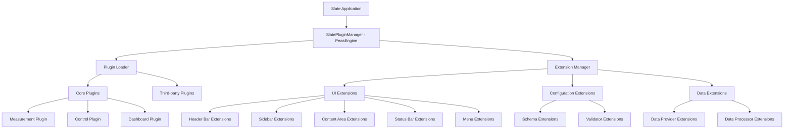

# Plugin System Specification

**Document:** 2025-08-22-plugin-system.md
**Version:** 1.0
**Status:** Draft

## Overview

This specification defines the plugin system architecture for Slate, built on libpeas, that enables extensibility across all application functionality while maintaining stability, security, and performance.

## Purpose

Create a robust plugin system that allows third-party developers to extend Slate's functionality through well-defined interfaces, supporting multiple programming languages and providing comprehensive integration points throughout the application.

## Plugin Architecture



## Core Plugin System

### SlatePluginManager

#### Purpose

Central plugin management system built on libpeas that handles plugin discovery, loading, lifecycle management, and communication.

#### Responsibilities

- Plugin discovery and enumeration
- Plugin loading and unloading
- Extension point management
- Plugin dependency resolution
- Plugin configuration management
- Security and sandboxing enforcement

#### API Design

```c
// Plugin manager initialization
SlatePluginManager* slate_plugin_manager_new(void);
void slate_plugin_manager_set_search_paths(SlatePluginManager* manager, char** paths);

// Plugin lifecycle
gboolean slate_plugin_manager_load_plugin(SlatePluginManager* manager, const char* plugin_id, GError** error);
gboolean slate_plugin_manager_unload_plugin(SlatePluginManager* manager, const char* plugin_id, GError** error);
gboolean slate_plugin_manager_is_plugin_loaded(SlatePluginManager* manager, const char* plugin_id);

// Plugin enumeration
GList* slate_plugin_manager_get_available_plugins(SlatePluginManager* manager);
GList* slate_plugin_manager_get_loaded_plugins(SlatePluginManager* manager);

// Extension management
void slate_plugin_manager_register_extension_point(SlatePluginManager* manager, const char* extension_point, GType extension_type);
GList* slate_plugin_manager_get_extensions(SlatePluginManager* manager, const char* extension_point);
```

### Plugin Metadata

#### Plugin Descriptor (.plugin file)

```ini
[Plugin]
Module=measurement-plugin
Name=Measurement Plugin
Description=Provides measurement and data acquisition capabilities
Authors=Slate Team <team@slate.org>
Copyright=Copyright © 2025 Slate Team
Website=https://slate.org/plugins/measurement
Version=1.0.0
License=GPL-3.0+

# Dependencies
Depends=slate-core >= 1.0.0
Builtin=false

# Capabilities
Loader=C
Icon=measurement-icon

# Extension points this plugin provides
Provides=slate.measurement.provider;slate.ui.widget

# Extension points this plugin requires
Requires=slate.core.application;slate.ui.sidebar
```

### Plugin Directory Structure

```
plugin-name/
├── plugin-name.plugin          # Plugin metadata
├── lib/
│   └── libplugin-name.so      # Plugin binary (C/Vala)
├── data/
│   ├── icons/                 # Plugin-specific icons
│   ├── ui/                    # UI definition files
│   └── schemas/               # Configuration schemas
├── doc/
│   └── README.md             # Plugin documentation
└── examples/
    └── config-example.hcl    # Example configurations
```

## Extension Points

### UI Extension Points

#### Header Bar Extensions (slate.ui.headerbar)

```c
// Header bar extension interface
typedef struct _SlateHeaderBarExtension SlateHeaderBarExtension;
typedef struct _SlateHeaderBarExtensionInterface SlateHeaderBarExtensionInterface;

struct _SlateHeaderBarExtensionInterface {
    GTypeInterface parent_interface;

    // Add action buttons to header bar
    void (*add_action_button)(SlateHeaderBarExtension* extension, GtkWidget* button, SlateHeaderBarPosition position);

    // Modify title display
    void (*set_title_widget)(SlateHeaderBarExtension* extension, GtkWidget* widget);

    // Add menu items
    void (*add_menu_item)(SlateHeaderBarExtension* extension, GMenuItem* item, const char* section);
};

#define SLATE_TYPE_HEADER_BAR_EXTENSION (slate_header_bar_extension_get_type())
G_DECLARE_INTERFACE(SlateHeaderBarExtension, slate_header_bar_extension, SLATE, HEADER_BAR_EXTENSION, GObject)
```

#### Sidebar Extensions (slate.ui.sidebar)

```c
// Sidebar extension interface
typedef struct _SlateSidebarExtension SlateSidebarExtension;
typedef struct _SlateSidebarExtensionInterface SlateSidebarExtensionInterface;

struct _SlateSidebarExtensionInterface {
    GTypeInterface parent_interface;

    // Add sidebar panels
    void (*add_panel)(SlateSidebarExtension* extension, GtkWidget* panel, const char* title, int priority);

    // Remove sidebar panels
    void (*remove_panel)(SlateSidebarExtension* extension, const char* panel_id);

    // Update panel content
    void (*update_panel)(SlateSidebarExtension* extension, const char* panel_id, GtkWidget* new_content);
};

#define SLATE_TYPE_SIDEBAR_EXTENSION (slate_sidebar_extension_get_type())
G_DECLARE_INTERFACE(SlateSidebarExtension, slate_sidebar_extension, SLATE, SIDEBAR_EXTENSION, GObject)
```

#### Content Area Extensions (slate.ui.content)

```c
// Content area extension interface
typedef struct _SlateContentExtension SlateContentExtension;
typedef struct _SlateContentExtensionInterface SlateContentExtensionInterface;

struct _SlateContentExtensionInterface {
    GTypeInterface parent_interface;

    // Add new views/pages
    void (*add_view)(SlateContentExtension* extension, GtkWidget* view, const char* title, const char* icon_name);

    // Get view widget for modification
    GtkWidget* (*get_view)(SlateContentExtension* extension, const char* view_id);

    // Navigation control
    void (*activate_view)(SlateContentExtension* extension, const char* view_id);
};

#define SLATE_TYPE_CONTENT_EXTENSION (slate_content_extension_get_type())
G_DECLARE_INTERFACE(SlateContentExtension, slate_content_extension, SLATE, CONTENT_EXTENSION, GObject)
```

### Configuration Extensions

#### Schema Extensions (slate.config.schema)

```c
// Configuration schema extension
typedef struct _SlateConfigSchemaExtension SlateConfigSchemaExtension;
typedef struct _SlateConfigSchemaExtensionInterface SlateConfigSchemaExtensionInterface;

struct _SlateConfigSchemaExtensionInterface {
    GTypeInterface parent_interface;

    // Register configuration schemas
    void (*register_schema)(SlateConfigSchemaExtension* extension, const char* section, GVariant* schema);

    // Custom validation
    gboolean (*validate_config)(SlateConfigSchemaExtension* extension, const char* section, GVariant* config, GError** error);

    // Default value provision
    GVariant* (*get_default_config)(SlateConfigSchemaExtension* extension, const char* section);
};

#define SLATE_TYPE_CONFIG_SCHEMA_EXTENSION (slate_config_schema_extension_get_type())
G_DECLARE_INTERFACE(SlateConfigSchemaExtension, slate_config_schema_extension, SLATE, CONFIG_SCHEMA_EXTENSION, GObject)
```

### Data Extensions

#### Data Provider Extensions (slate.data.provider)

```c
// Data provider extension interface
typedef struct _SlateDataProviderExtension SlateDataProviderExtension;
typedef struct _SlateDataProviderExtensionInterface SlateDataProviderExtensionInterface;

struct _SlateDataProviderExtensionInterface {
    GTypeInterface parent_interface;

    // Data source registration
    void (*register_data_source)(SlateDataProviderExtension* extension, const char* source_id, SlateDataSource* source);

    // Data streaming
    void (*start_data_stream)(SlateDataProviderExtension* extension, const char* source_id);
    void (*stop_data_stream)(SlateDataProviderExtension* extension, const char* source_id);

    // Data query
    GVariant* (*query_data)(SlateDataProviderExtension* extension, const char* source_id, SlateDataQuery* query);
};

#define SLATE_TYPE_DATA_PROVIDER_EXTENSION (slate_data_provider_extension_get_type())
G_DECLARE_INTERFACE(SlateDataProviderExtension, slate_data_provider_extension, SLATE, DATA_PROVIDER_EXTENSION, GObject)
```

## Plugin Communication

### Inter-Plugin Communication

#### Service Registry

```c
// Service registration and discovery
typedef struct _SlateServiceRegistry SlateServiceRegistry;

// Service registration
gboolean slate_service_registry_register_service(
    SlateServiceRegistry* registry,
    const char* service_name,
    GObject* service_implementation,
    GError** error
);

// Service discovery
GObject* slate_service_registry_get_service(
    SlateServiceRegistry* registry,
    const char* service_name
);

// Service listing
GList* slate_service_registry_list_services(
    SlateServiceRegistry* registry,
    const char* service_type
);
```

#### Event System

```c
// Event publishing and subscription
typedef struct _SlateEventBus SlateEventBus;

// Event subscription
gulong slate_event_bus_subscribe(
    SlateEventBus* bus,
    const char* event_type,
    SlateEventCallback callback,
    gpointer user_data
);

// Event publishing
void slate_event_bus_publish(
    SlateEventBus* bus,
    const char* event_type,
    GVariant* event_data
);

// Event unsubscription
void slate_event_bus_unsubscribe(
    SlateEventBus* bus,
    gulong subscription_id
);
```

### Plugin Configuration Access

#### Configuration API

```c
// Plugin configuration access
typedef struct _SlatePluginConfig SlatePluginConfig;

// Configuration reading
GVariant* slate_plugin_config_get_value(
    SlatePluginConfig* config,
    const char* key
);

GVariant* slate_plugin_config_get_section(
    SlatePluginConfig* config,
    const char* section
);

// Configuration writing
gboolean slate_plugin_config_set_value(
    SlatePluginConfig* config,
    const char* key,
    GVariant* value,
    GError** error
);

// Configuration monitoring
gulong slate_plugin_config_connect_changed(
    SlatePluginConfig* config,
    const char* key,
    SlateConfigChangedCallback callback,
    gpointer user_data
);
```

## Language Support

### C Language Support

- Native libpeas support
- Direct GObject integration
- Full API access
- High performance

### Vala Language Support

- Compile to C with GObject bindings
- Type-safe plugin development
- Automatic memory management
- Familiar syntax for GTK developers

### Python Language Support (Future)

```python
# Python plugin example
import gi
gi.require_version('Slate', '1.0')
from gi.repository import Slate, Gtk, GObject

class PythonPlugin(GObject.Object, Slate.UIExtension):
    def do_activate(self):
        button = Gtk.Button(label="Python Action")
        self.add_header_action(button)

    def do_deactivate(self):
        # Cleanup
        pass
```

### JavaScript Language Support (Future)

```javascript
// JavaScript plugin example
const { Slate, Gtk } = imports.gi;

var PluginClass = class extends Slate.UIExtension {
  activate() {
    let button = new Gtk.Button({ label: "JS Action" });
    this.add_header_action(button);
  }

  deactivate() {
    // Cleanup
  }
};
```

## Security and Sandboxing

### Security Principles

- Principle of least privilege
- API surface minimization
- Resource access control
- Plugin isolation

### Security Measures

#### File System Access

```c
// Restricted file system operations
typedef enum {
    SLATE_PLUGIN_ACCESS_NONE,
    SLATE_PLUGIN_ACCESS_READ_ONLY,
    SLATE_PLUGIN_ACCESS_READ_WRITE,
    SLATE_PLUGIN_ACCESS_FULL
} SlatePluginAccessLevel;

// File access request
gboolean slate_plugin_request_file_access(
    SlatePlugin* plugin,
    const char* path,
    SlatePluginAccessLevel level,
    GError** error
);
```

#### Network Access Control

```c
// Network permission system
gboolean slate_plugin_request_network_access(
    SlatePlugin* plugin,
    const char* hostname,
    int port,
    GError** error
);
```

#### Resource Limits

```c
// Resource usage monitoring
typedef struct {
    size_t max_memory;      // Maximum memory usage
    int max_threads;        // Maximum thread count
    int max_file_handles;   // Maximum open files
    int max_network_connections; // Maximum network connections
} SlatePluginResourceLimits;

void slate_plugin_set_resource_limits(
    SlatePlugin* plugin,
    SlatePluginResourceLimits* limits
);
```

## Plugin Development Tools

### Plugin Template Generator

```bash
# Command-line tool for plugin scaffolding
slate-plugin-create --name="my-plugin" --type="c" --extensions="ui,config"
slate-plugin-create --name="data-logger" --type="vala" --extensions="data,config"
```

### Development Environment

- Plugin development documentation
- API reference generation
- Debug logging integration
- Hot-reload support for development

### Testing Framework

```c
// Plugin testing utilities
typedef struct _SlatePluginTestSuite SlatePluginTestSuite;

SlatePluginTestSuite* slate_plugin_test_suite_new(const char* plugin_id);
void slate_plugin_test_suite_add_test(SlatePluginTestSuite* suite, const char* test_name, SlateTestFunc test_func);
gboolean slate_plugin_test_suite_run(SlatePluginTestSuite* suite);
```

## Plugin Distribution

### Plugin Packaging

- Standard .tar.gz format
- Metadata validation
- Dependency checking
- Digital signatures

### Plugin Repository

- Central plugin registry
- Version management
- Update notifications
- Security scanning

### Installation Methods

- Built-in plugin manager
- Command-line tools
- Manual installation
- Package manager integration

## Performance Considerations

### Loading Performance

- Lazy plugin loading
- Dependency optimization
- Parallel loading where safe
- Memory usage monitoring

### Runtime Performance

- Plugin call optimization
- Event system efficiency
- Resource usage tracking
- Performance profiling hooks

### Plugin Lifecycle Management

```c
// Plugin state management
typedef enum {
    SLATE_PLUGIN_STATE_UNLOADED,
    SLATE_PLUGIN_STATE_LOADING,
    SLATE_PLUGIN_STATE_LOADED,
    SLATE_PLUGIN_STATE_ACTIVE,
    SLATE_PLUGIN_STATE_ERROR,
    SLATE_PLUGIN_STATE_UNLOADING
} SlatePluginState;

SlatePluginState slate_plugin_get_state(SlatePlugin* plugin);
void slate_plugin_set_state(SlatePlugin* plugin, SlatePluginState state);
```

## Error Handling and Debugging

### Error Reporting

```c
// Plugin error reporting
typedef struct {
    SlatePluginErrorType type;
    char* message;
    char* plugin_id;
    char* function_name;
    int error_code;
} SlatePluginError;

void slate_plugin_report_error(SlatePlugin* plugin, SlatePluginError* error);
```

### Debug Support

- Plugin-specific logging
- Performance profiling
- Memory leak detection
- Event tracing

### Recovery Mechanisms

- Plugin crash isolation
- Automatic plugin restart
- Graceful degradation
- Error state recovery

## Testing Strategy

### Unit Testing

- Plugin interface compliance
- Extension point functionality
- Security constraint validation

### Integration Testing

- Plugin communication
- UI integration
- Configuration interaction

### Performance Testing

- Plugin loading time
- Memory usage
- CPU utilization
- Resource cleanup

## Future Enhancements

### Advanced Features

- Plugin hot-swapping
- Plugin versioning support
- Plugin marketplace
- Cloud-based plugins

### Language Expansion

- Rust language support
- Go language support
- WebAssembly plugins
- Remote plugins (network-based)

### Development Tools

- Visual plugin builder
- Plugin debugging IDE
- Performance analysis tools
- Automated testing framework
