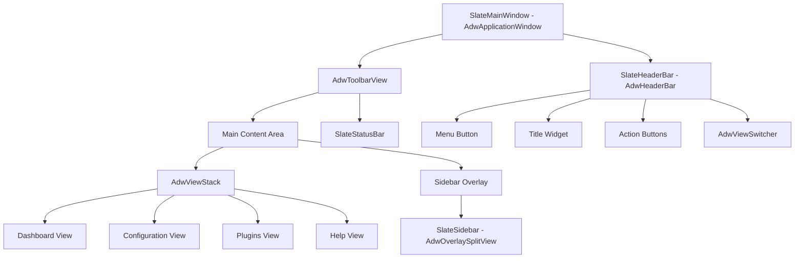
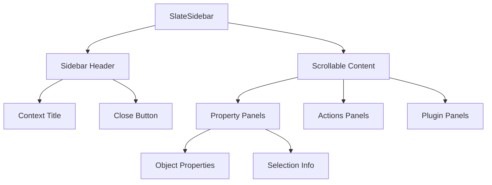

# User Interface Components Specification

**Document:** 2025-08-22-user-interface-components.md
**Version:** 1.0
**Status:** Draft

## Overview

This specification defines the user interface components that make up the Slate application, including layout, behavior, styling, and interaction patterns for all major UI elements.

## Purpose

Define a consistent, accessible, and extensible user interface that follows GNOME Human Interface Guidelines while providing the flexibility needed for a plugin-based application framework.

## Component Architecture

## Header Bar (SlateHeaderBar)

### Purpose

Provides primary navigation, application title, and critical actions following GNOME HIG patterns.

### Design Requirements

#### Layout

- Extends `AdwHeaderBar`
- Left side: Application menu button, back/forward navigation (context-dependent)
- Center: Application title and subtitle
- Right side: Primary actions, view switcher, sidebar toggle

#### Title Management

- **Primary Title:** "Slate" (application name)
- **Subtitle:** Current project name or current view context
- Dynamic updates based on active content

#### Actions

- **Primary Menu:** Application-wide actions and preferences
- **Project Actions:** Save, Open, Close project (when applicable)
- **View Actions:** Context-specific actions for current view
- **Sidebar Toggle:** Show/hide sidebar panel

### Plugin Integration

- Plugins can add action buttons to designated areas
- Plugins can modify title/subtitle through controlled APIs
- Plugins cannot completely hide or replace the header bar

### Responsive Behavior

- Collapse less important actions into overflow menu on narrow windows
- Title truncation with tooltip on overflow
- View switcher adapts to available space

## Slideout Sidebar (SlateSidebar)

### Purpose

Provides contextual information and controls for selected objects and focused content.

### Design Requirements

#### Layout

- Implements `AdwOverlaySplitView` pattern
- Slides in from the right edge
- Collapsible with persistent state
- Minimum width: 280px, Maximum width: 400px

#### Content Structure

#### Behavior

- **Auto-show:** Appears when objects are selected
- **Persistence:** Remembers open/closed state
- **Context Switching:** Content updates based on current selection
- **Empty State:** Shows helpful message when no selection

### Plugin Integration

- Plugins can register sidebar panels
- Panels are organized by priority and context
- Plugin panels can be collapsed independently

## Main Content Area

### Purpose

Houses the primary application content with stack-based navigation between different functional areas.

### Design Requirements

#### Navigation Pattern

- Uses `AdwViewStack` for page management
- Smooth transitions between views
- State preservation during view switching

#### View Management

- **Dashboard View:** Project visualization and interaction
- **Configuration View:** HCL editing and graphical configuration
- **Plugins View:** Plugin management interface
- **Help View:** Documentation and tutorials

### Responsive Design

- Uses `AdwClamp` for content width management
- Breakpoints for different window sizes:
  - **Narrow:** < 768px (mobile-like)
  - **Medium:** 768px - 1200px (tablet-like)
  - **Wide:** > 1200px (desktop)

## Status Bar (SlateStatusBar)

### Purpose

Displays application status, progress indicators, and secondary information.

### Design Requirements

#### Layout

- Fixed height bar at bottom of window
- Left side: Status messages and indicators
- Right side: Progress indicators and secondary actions

#### Content Types

- **Status Messages:** Current operation, selection info
- **Progress Indicators:** Long-running operations
- **Notification Area:** Non-critical alerts
- **Connection Status:** External system connections

### Plugin Integration

- Plugins can add status indicators
- Limited space requires priority system
- Overflow into popup for less important items

## Preferences Dialog

### Purpose

Provides access to application-wide settings and configuration options.

### Design Requirements

#### Layout

- Uses `AdwPreferencesWindow`
- Organized into logical groups
- Search functionality for settings

#### Categories

- **General:** Basic application behavior
- **Appearance:** Theme and display options
- **Plugins:** Plugin management and configuration
- **Advanced:** Developer and power-user options

### Plugin Integration

- Plugins can add preference pages
- Plugin preferences grouped separately
- Consistent styling with core preferences

## Dialog Standards

### Design Principles

- Use native GTK4/Libadwaita dialogs
- Consistent button placement and labeling
- Proper keyboard navigation
- Accessibility compliance

### Common Dialogs

- **File Chooser:** Project and configuration files
- **Confirmation:** Destructive actions
- **Error:** Error reporting with details
- **About:** Application information

## Accessibility Requirements

### Keyboard Navigation

- Full keyboard accessibility
- Logical tab order
- Keyboard shortcuts for primary actions
- Focus indicators clearly visible

### Screen Reader Support

- Proper ARIA labels and roles
- Descriptive text for all interactive elements
- Context information for dynamic content

### Visual Accessibility

- High contrast mode support
- Scalable text and UI elements
- Color not the only means of conveying information

## Theming and Styling

### Design System

- Follows Libadwaita design patterns
- Supports light and dark themes automatically
- Custom CSS limited to essential branding

### Color Palette

- Uses Libadwaita semantic colors
- Accent colors for branding elements
- Status colors for success/warning/error states

### Typography

- System font stack
- Consistent font sizes and weights
- Proper line spacing and readability

## Responsive Behavior

### Window Sizing

- Minimum window size: 640x480
- Optimal size: 1024x768
- Adaptive layout for different aspect ratios

### Breakpoint Behavior

- **Mobile-like (< 768px):**
  - Stack navigation becomes primary
  - Sidebar becomes modal overlay
  - Toolbar items collapse aggressively
- **Desktop (> 768px):**
  - Full layout with all panels visible
  - Sidebar can be pinned open
  - All toolbar items visible

## Performance Considerations

### Rendering Optimization

- Lazy loading of sidebar content
- Virtualization for large lists
- Efficient redraw on theme changes

### Memory Management

- Proper widget destruction
- Image caching strategies
- Plugin UI cleanup on unload

## Testing Requirements

### Visual Testing

- Screenshot comparison for different themes
- Layout testing at various window sizes
- Focus indicator visibility

### Interaction Testing

- Keyboard navigation paths
- Touch/click target sizes
- Gesture support where applicable

### Accessibility Testing

- Screen reader compatibility
- High contrast mode functionality
- Keyboard-only operation

## Future Enhancements

### Planned Features

- Customizable toolbar layouts
- User-defined keyboard shortcuts
- Advanced theming options
- Multi-window support

### Extensibility

- Plugin-defined custom widgets
- Theme-aware plugin UIs
- Dynamic layout adaptation
